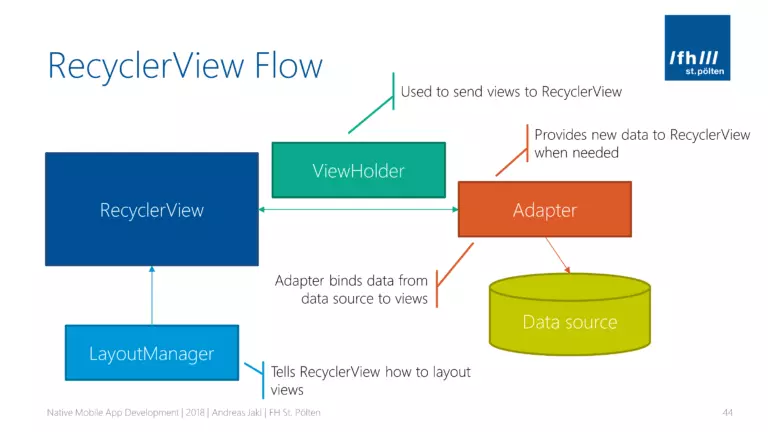
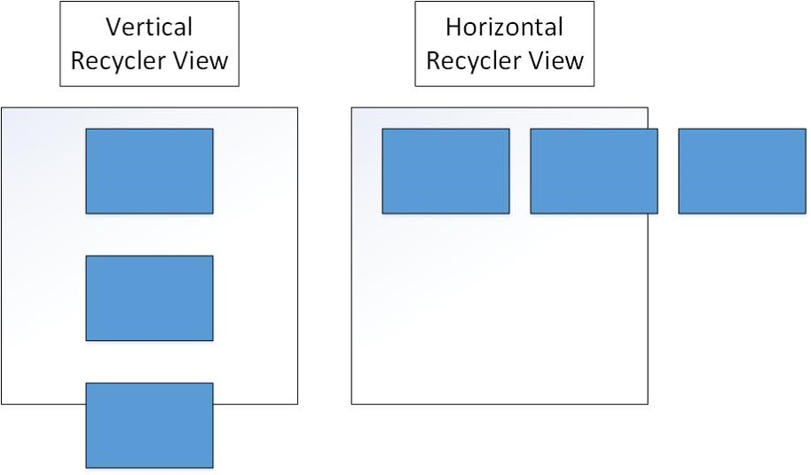
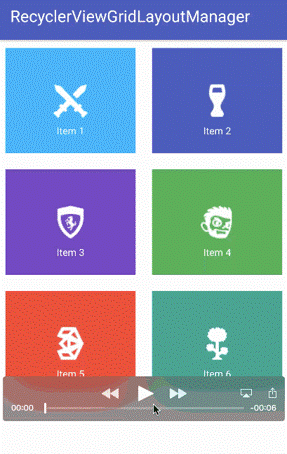

# Recycler View trong Android và các thành phần liên quan
## Tổng qua về Recycler View
- RecyclerView là một ViewGroup nó được dùng để chuẩn bị và hiển thị các View tượng tự nhau. RecyclerView được cho là sự kế thừa của ListView và GridView.
* ListView là một thành phần giao diện được sử dụng để hiển thị danh sách các mục dưới dạng danh sách cuộn dọc. * GridView là một thành phần giao diện được sử dụng để hiển thị các mục dưới dạng một lưới (grid), với các mục được sắp xếp thành hàng và cột.
- Một trong những lý do khiến RecyclerView được ưa chuộng là nó là một framework có thể mở rộng, và đặc biệt nó cung cấp khả năng triển khai cả bố cục Horizontal và Vertical

* Các thành phần của RecyclerView và RecyclerView Flow
    
    * Adapter: Đây là nơi xử lý dữ liệu và gán cho View
    ```kotlin
    class TrendingAdapter(private var podcastList: MutableList<Podcast>) :
    RecyclerView.Adapter<MyViewHolder>() {

    }
    ```
    - Ở Adapter mình sẽ truyền vào một cái List các danh sách sản phẩm cần hiển thị. Được kế thừa từ thằng Adapter của RecyclerView truyền vào một ViewHolder
    - Trong Adapter mình thường override lại 3 phương thức của Adapter của RecyclerView:
        - `onCreateViewHolder(parent: ViewGroup, viewType: Int): MyViewHolder {}` : Phương thức này được gọi bất cứ khi nào cần tạo ViewHolder mới. Phương thức này tạo và khởi động ViewHolder cùng với View đã liên kết, nhưng không điền vào nội dung của thành phần hiển thị – ViewHolder chưa liên kết với dữ liệu cụ thể. Adapter sẽ trả về bố cục xml
        - `onBindViewHolder(holder: MyViewHolder, position: Int) {}`: Phương thức này tìm nạp dữ liệu thích hợp và sử dụng dữ liệu đó để điền vào bố cục của ngăn chứa thành phần hiển thị. Ví dụ: nếu RecyclerView hiển thị một danh sách tên, phương thức này có thể tìm tên thích hợp trong danh sách và điền vào tiện ích TextView của ngăn chứa thành phần hiển thị. Nói chung là khi ViewHolder trước đó được sd lại thì sẽ gọi đến đây
        - `getItemCount()`: Phương thức này để lấy kích thước của tập dữ liệu.
        Ví dụ về 1 File Adapter:
        ```kotlin
        class TrendingAdapter(private var podcastList: MutableList<Podcast>) :
        RecyclerView.Adapter<MyViewHolder>() {

            private var isExpanded = false

            fun updateData(newList: MutableList<Podcast>, expanded: Boolean) {
                this.podcastList = newList
                this.isExpanded = expanded
                notifyDataSetChanged()
            }

            override fun onCreateViewHolder(parent: ViewGroup, viewType: Int): MyViewHolder {
                val binding = ItemTrendingPodcastBinding.inflate(
                    LayoutInflater.from(parent.context),
                    parent,
                    false
                )
                return MyViewHolder(binding)
            }

            override fun onBindViewHolder(holder: MyViewHolder, position: Int) {
                val podcast = podcastList[position]
                holder.bind(podcast)
            }

            override fun getItemCount(): Int {
                return podcastList.size
            }
        }
        ```
    * ViewHolder: lớp dùng để gán / cập nhật dữ liệu vào các phần tử trong RecyclerView. Kế thừa từ ViewHolder của Recycler View
    ```kotlin
    class MyViewHolder(private val binding: ItemTrendingPodcastBinding) :
    RecyclerView.ViewHolder(binding.root) {

        fun bind(podcast: Podcast) {
            binding.tvPodcastTitle.text = podcast.title
            binding.tvPodcastCategory.text = podcast.category
            binding.tvPodcastDuration.text = podcast.duration

            Glide.with(binding.root.context)
                .load(podcast.imageUrl)
                .placeholder(R.drawable.ic_launcher_background)
                .error(R.drawable.ic_launcher_foreground)
                .centerCrop()
                .into(binding.ivPodcastImage)

            binding.ivPlayButton.setOnClickListener {
                Toast.makeText(binding.root.context, "Playing: ${podcast.title}", Toast.LENGTH_SHORT)
                    .show()
            }

            binding.root.setOnClickListener {
                Toast.makeText(binding.root.context, "Open: ${podcast.title}", Toast.LENGTH_SHORT)
                    .show()
            }
        }
    }
    ```
    * LayoutManager: xác định ra vị trí của các Item trong RecyclerView
        - LinearLayoutManager:  hiển thị các item trong danh sách có thể cuộn theo chiều dọc (horizontal) hoặc chiều ngang (vertical).
        
        - GridLayoutManager: Hiển thị item dạng lưới
        
    * ItemAnimator
        - RecyclerView.ItemAnimator là một lớp dùng để thêm hiệu ứng khi thay đổi các phần tử trong RecyclerView. Khi thêm, xóa hoặc cập nhật các phần tử trong RecyclerView, ItemAnimator sẽ xử lý các hiệu ứng chuyển động của các phần tử này, giúp tạo ra các hoạt hình mượt mà và sống động.
        - DefaultItemAnimator: là ItemAnimator mặc định được sử dụng khi không cung cấp bất kỳ ItemAnimator nào. Nó cung cấp các hiệu ứng mặc định khi thêm, xóa và cập nhật các phần tử.

## Ưu - Nhược điểm của việc sử dụng RecyclerView
* Ưu điểm:
- Giúp tiết kiệm rất nhiều thời gian xử lý, đồng thời giúp cuộn danh sách mượt mà hơn: Khi một phần tử trong danh sách được cuộn khỏi màn hình, RecyclerView sẽ sử dụng lại thành phần hiển thị đó cho phần tử sắp hiện tiếp theo trong danh sách
- Được thiết kế rất hiệu quả, có thể sử dụng cho những danh sách lớn: cho phép sử dụng lại hoặc tái chế các thành phần hiển thị (view) đã cuộn ra khỏi màn hình.
- Cho phép Layout các item trong listView theo các kiểu khác nhau (ngang, dọc, dạng grid, dạng staggered grid). → Tối ưu hơn ListView
- Hỗ trợ cho Animation: RecyclerView hỗ trợ dễ dàng các hiệu ứng và hoạt hình khi thêm, xóa hoặc cập nhật các phần tử trong danh sách. Điều này giúp cải thiện trải nghiệm người dùng và làm cho ứng dụng trở nên sống động hơn.
* Nhược điểm:
- Cấu trúc phức tạp với các Adapter và ViewHolder
- Phức tạp trong xử lí event
- Khó học với người mới

## Tính tái sử dụng của RecyclerView
- Một khi RecyclerView được kết nối với Adapter , Adapter sẽ tạo ra đối tượng của các hàng (ViewHolder object) cho đến khi lấp đầy kích thước của RecyclerView và lưu trong HeapMemory. Sau đó sẽ không tạo thêm bất kỳ hàng nào để lưu trong bộ nhớ nữa.
- Khi người dùng trượt danh sách, các item đã trượt khỏi màn hình sẽ được lưu trong bộ nhớ để tái sử dụng sau, và mỗi khi item mới được chèn vào thì đối tượng ViewHolder được lưu trong bộ nhớ sẽ được mang ra tái sử dụng và gán dữ liệu. Nếu không gán lại dữ liệu cho ViewHolder object thì sẽ hiện thị dữ liệu được gán trước đó.
- ViewHolder sẽ không cần được tạo mới mà chỉ cập nhật dữ liệu của chúng. Theo cách này thì kể cả danh sách có 1000 item, thì chỉ có khoảng 7 đối tượng ViewHolder được tạo ra.

## Adapter và ListAdapter
* Adapter đã tìm hiểu ở bên trên
* ListAdapter:
    - ListAdapter là một class mới trong support library 27.1.0 và đơn giản hóa code cần thiết để làm việc với RecyclerView. Và kết quả màn bạn nhật được là bạn cần viết ít code hơn và recyclerview animation hoạt động tốt hơn.

    ListAdapter tự động lưu trữ list item trước và sử dụng DiffUtil để chỉ update những items trong recycler mà có sự thay đổi.

    Adapter mặc định chỉ xử lý việc thêm một item mới và không xử lý việc xóa hoặc sửa một item. Có thể sử dụng notifyDataSetChanged() nhưng nó sẽ vẽ lại tất cả các view, kể cả những phần không bị thay đổi. Để xử lý chúng sao cho hiệu năng tốt và animation đẹp, chúng ta cần làm nhiều việc hơn một chút đó là sử dụng DiffUtil.  
* DiffUtil
- ListAdapter xây dựng dựa trên DiffUtil nghĩa là nó giúp bạn xử lý một vài diffing logic. Nếu bạn chưa từng biết về DiffUtils thì nó được tạo ra để khuyến khích developer cho phép RecyclerView chỉ update nội dung thay đổi, dẫn đến hiệu suất tốt hơn khi những item được inserted, updated hoặc deleted.

- Để xác định dữ liệu mới, DiffUtil yêu cầu bạn ghi đè các phương thức areItemsTheSame() và areContentsTheSame(). areItemsTheSame() kiểm tra xem hai mục có thực sự là cùng một mục không. areContentsTheSame() kiểm tra xem hai mục có dữ liệu giống nhau không.

- Trong lớp Adapter, thêm một đối tượng DiffUtil ghi đè các phương thức areItemsTheSame() và areContentsTheSame()

- Cách khai báo ListAdapter:
    ```kotlin
    class CustomAdapter : ListAdapter<Data_Class, CustomAdapter.MyViewHolder>(MyDiffUtil()) {
        // Override lại 3 phương thức onCreateViewHolder, onBindViewHolder và getItemCount
    }
    ```

    ```kotlin
    class MyViewHolder(biding : file_xml của RecyclerView) : RecyclerView.ViewHolder(binding.root) {
        // Xử lí thêm các nọi dung vào các element trong file xml
    }
    ```

    ```kotlin
    class MyDiffuntil : DiffUtil.ItemCallback<Data_class> () {
        override fun areItemViewHolder (oldItem: Data_class, newItem: Data_class): Boolean {
            //TODO
        }
        override fun areContentsTheSame (oldItem: Data_class, newItem: Data_class): Boolean {
            //TODO
        }
    }
    ```
- Sử dụng trong MainActivity:

```kotlin
var userList = listof()
override fun onCreate(savedInstancState: Bundle?)
{
    myAdapter = CustomAdapter()
    binding.(chỗ RecyclerView).apply{
        linearManager = LinearLayoutManager (this)
        adapter = myAdapter
    }
    myAdapter.submit(userList)
}
```

## RecyclerView Mutiple View Type
- Trong Android, RecyclerView hỗ trợ nhiều kiểu hiển thị (view types) khác nhau trong cùng một danh sách. Điều này rất hữu ích khi bạn muốn hiển thị các loại item khác nhau trong danh sách, chẳng hạn như một số item là hình ảnh, một số là văn bản, hoặc một số có các kiểu bố trí khác nhau.

- Việc chúng ta xây dựng RecylerView có nhiều kiểu item khác nhau cũng giống như RecyclerView chỉ có 1 kiểu item nhưng có một chút khác biệt ở ở Custom Adapter như sau:

    - Phải tạo ViewHolder cho từng kiểu view
    - Tạo các file XML layout khác nhau cho từng kiểu view mà bạn muốn hiển thị.
    - Override lại phương thức getItemViewType(position: Int) để get type tương ứng với từng position
    - Trong fun onCreateViewHolder() dựa vào view type để tạo ViewHolder tương ứng.
    - Trong fun onBindViewHolder() dựa và view type để bind data tương ứng vào ViewHolder.
Ví dụ:

Lớp adapter với 2 view type:
```kotlin
class MainAdapter(
    private val typeOneList: MutableList<String>,
    private val typeTwoList: MutableList<String>
) : RecyclerView.Adapter<RecyclerView.ViewHolder>() {
    override fun onCreateViewHolder(p0: ViewGroup, p1: Int): RecyclerView.ViewHolder {
        val inflater = LayoutInflater.from(p0?.context)
        return when (p1) {
            ViewType.TYPE_ONE.type -> {
                val view = inflater.inflate(R.layout.type_one, p0, false)
                TypeOneViewHodel(view)
            }
            else -> {
                val view = inflater.inflate(R.layout.type_two, p0, false)
                TypeTwoViewHodel(view)
            }
        }

    }

    override fun getItemCount(): Int {
        return typeOneList.count() + typeTwoList.count()
    }

    override fun onBindViewHolder(p0: RecyclerView.ViewHolder, p1: Int) {
        p0.apply {
            when (p0) {
                is TypeOneViewHodel -> p0.bind(typeOneList[p1])
                is TypeTwoViewHodel -> p0.bind(typeTwoList[p1 - typeOneList.count() ])
            }
        }
    }

    override fun getItemViewType(position: Int): Int {
        return when (position) {
            in 0 until typeOneList.count() -> ViewType.TYPE_ONE.type
            else -> ViewType.TYPE_TWO.type
        }
    }

    inner class TypeOneViewHodel(itemView: View) : RecyclerView.ViewHolder(itemView) {
        fun bind(item: String) {
            with(itemView) {
                tvContact.text = item
            }

        }

    }

    inner class TypeTwoViewHodel(itemView: View) : RecyclerView.ViewHolder(itemView) {
        fun bind(item: String) {
            with(itemView) {
                tvAccount.text = item

            }
        }

    }

}

enum class ViewType(val type: Int) {
    TYPE_ONE(0),
    TYPE_TWO(1)
}
```
Trong class Activity:
```kotlin
 fun initView() {
        addTypeList1()
        addTypeList2()
        recyclerView.layoutManager = LinearLayoutManager(this)
        recyclerView.adapter = MainAdapter(typeOneList, typeTwoList)
    }

fun addTypeList1() {
    typeOneList.add("type 1 1")
    typeOneList.add("type 1 2")
    typeOneList.add("type 1 3")
    typeOneList.add("type 1 4")
    typeOneList.add("type 1 5")

}

fun addTypeList2() {
    typeTwoList.add("type 2 1")
    typeTwoList.add("type 2 2")
    typeTwoList.add("type 2 3")
    typeTwoList.add("type 2 4")
    typeTwoList.add("type 2 5")
}
```