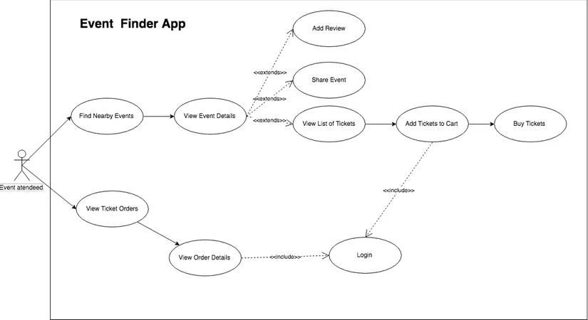

# Tìm hiểu về Navigation trong Android
## 1. AndroidX Navigation, nav_graph
- AndroidX Navigation (thường gọi tắt là Jetpack Navigation component) là một framework giúp xây dựng điều hướng trong ứng dụng Android theo cách nhất quán, bất kể điểm đến (destination) là Fragment, Activity hay các component khác.
- Ưu điểm của việc sử dụng Navigation:
    - Xử lý thay thế các Fragment Transactions
    - Xử lý chính xác các hành động trên nút back của màn hình hay nút back của app
    - Cung cấp các tài nguyên được tiêu chuẩn hóa cho animations và transaction
    - Thực hiện và xử lý liên kết sâu
    -Nó hỗ trợ các navigation UI patterns, navigation drawers, và bottom navigation.
    - Được hỗ trợ Safe Args giúp truyền dữ liệu qua các thành phần bên trong Navigation  được an toàn hơn.
    - Hỗ trợ ViewModel hoàn chỉnh - Chúng ta có thể điều chỉnh và mở rộng ViewModel thành biểu đồ điều hướng để chia sẻ dữ liệu liên quan đến giao diện người dùng giữa các điểm đến của biểu đồ.

* Các thành phần cốt lõi:
- Navigation Graph: là một cấu trúc mô tả toàn bộ các điểm đến và mối liên kết giữa chúng

- Gồm 2 thành phần:
    - Điểm đến (Navigation Destination): Có thể là một màn hình hoặc là một vài view trong ứng dụng
    - Hành động (Navigation Action): là một đường dẫn kết nối một destination với một destination khác. Một action sẽ cho biết destination nào nó đang kế nối và loại thông tin sẽ xảy ra giữa chừng
- NavHostFragment: Là một container đặc biệt dùng để chứa và quản lý các fragment mà ứng dụng sẽ điều hướng tới. Đây là nơi các fragment xuất hiện khi điều hướng.
    - Có 2 loại Navigation Host chính:
        - NavHostFragment: Là một Fragment đặc biệt được sử dụng làm Navigation Host, có thể thêm NavHostFragment vào layout của màn hình và liên kết nó với một Navigation Graph. NavHostFragment sẽ hiển thị các Fragments theo hành động điều hướng từ Navigation Graph.
        - NavHostActivity: là một Activity đặc biệt được sử dụng làm Navigation Host, có thể tạo một NavHostActivity và liên kết nó với một Navigation Graph. NavHostActivity sẽ hiển thị các Activities theo hành động điều hướng từ Navigation Graph.

- NavController: Được sử dụng để quản lý điều hướng giữa các điểm đến trong NavHostFragment. Nó cho phép bạn thực hiện điều hướng và quản lý back stack.
```kotlin
Fragment.findNavController()
View.findNavController()
Activity.findNavController(viewId: Int)
```

- NavDestination: Là các điểm đến cụ thể trong NavGraph. Mỗi destination đại diện cho một màn hình hoặc một nơi trong ứng dụng mà người dùng có thể đến.

- Safe Args: Là một plugin giúp truyền dữ liệu giữa các fragment hoặc activity một cách an toàn, tránh các lỗi thường gặp khi sử dụng Bundle trực tiếp.

### 1.1 Cách tạo một Project có Navigation
- B1: Khai báo thư viện
```kotlin
dependencies {
    val nav_version = "2.9.3" // Phiên bản mới nhất có thể khác, kiểm tra trang chính thức

    // Navigation
    implementation "androidx.navigation:navigation-fragment-ktx:$nav_version"
    implementation "androidx.navigation:navigation-ui-ktx:$nav_version"
}
```

- B2: Tạo NavHostFragment
    - Mở file activity_main.xml và đặt NavHostFragment làm container chính:
    ```kotlin
    <androidx.fragment.app.FragmentContainerView
    android:id="@+id/nav_host_fragment"
    android:name="androidx.navigation.fragment.NavHostFragment"
    android:layout_width="match_parent"
    android:layout_height="match_parent"
    app:defaultNavHost="true"
    app:navGraph="@navigation/nav_graph" />

    ```
- B3: Tạo Navigation Graph
    - Vào thư mục res → chuột phải → New > Android Resource File.

    - Đặt tên: nav_graph.xml.

    - Resource type: Navigation.
    ```xml
    <?xml version="1.0" encoding="utf-8"?>
    <navigation xmlns:android="http://schemas.android.com/apk/res/android"
        xmlns:app="http://schemas.android.com/apk/res-auto"
        android:id="@+id/nav_graph"
        app:startDestination="@id/homeFragment">

        <fragment
            android:id="@+id/homeFragment"
            android:name="com.example.navigationapp.HomeFragment"
            android:label="Home" >
            <action
                android:id="@+id/action_homeFragment_to_detailFragment"
                app:destination="@id/detailFragment" />
        </fragment>

        <fragment
            android:id="@+id/detailFragment"
            android:name="com.example.navigationapp.DetailFragment"
            android:label="Detail" />
    </navigation>

    ```
- B4: Tạo fragment
HomeFragment.kt
```kotlin
class HomeFragment : Fragment(R.layout.fragment_home) {
    override fun onViewCreated(view: View, savedInstanceState: Bundle?) {
        super.onViewCreated(view, savedInstanceState)

        val btn = view.findViewById<Button>(R.id.btnNavigate)
        btn.setOnClickListener {
            findNavController().navigate(R.id.action_homeFragment_to_detailFragment)
        }
    }
}

```

```xml
<LinearLayout xmlns:android="http://schemas.android.com/apk/res/android"
    android:layout_width="match_parent"
    android:layout_height="match_parent"
    android:gravity="center"
    android:orientation="vertical">

    <Button
        android:id="@+id/btnNavigate"
        android:layout_width="wrap_content"
        android:layout_height="wrap_content"
        android:text="Go to Detail" />
</LinearLayout>

```

DetailFragment.kt
```kotlin
package com.example.myapplication.fragment

import android.os.Bundle
import android.view.View
import android.widget.Button
import androidx.fragment.app.Fragment
import androidx.navigation.fragment.findNavController
import com.example.myapplication.R

class DetailFragment : Fragment(R.layout.fragment_detail) {
    override fun onViewCreated(view: View, savedInstanceState: Bundle?) {
        super.onViewCreated(view, savedInstanceState)

        val btn = view.findViewById<Button>(R.id.btnNavigate)
        btn.setOnClickListener {
            findNavController().navigate(R.id.action_homeFragment_to_detailFragment)
        }
    }
}

```
```xml
<LinearLayout xmlns:android="http://schemas.android.com/apk/res/android"
    android:layout_width="match_parent"
    android:layout_height="match_parent"
    android:gravity="center"
    android:orientation="vertical">

    <Button
        android:id="@+id/btnNavigate"
        android:layout_width="wrap_content"
        android:layout_height="wrap_content"
        android:text="Go to Detail" />
</LinearLayout>

```

Output:


- MainActivity mở layout activity_main.xml → trong đó có NavHostFragment → nav_graph quy định startDestination → Android tự load HomeFragment

* Cách truyền data giữa 2 fragment
- Cách 1: Dùng Bundle:
- Ví dụ truyền một giá trị name từ HomeFragment sang ProfileFragment.

- Sử dụng phương thức navigate().

```kotlin
view.findViewById<Button>(R.id.btnViewProfile)?.setOnClickListener {
    val bundle = bundleOf(
        "name" to "My Name",
    )
    findNavController().navigate(R.id.action_homeFragment_to_profileFragment, bundle)
}
```

- Nhận DL:
```kotlin
override fun onViewCreated(view: View, savedInstanceState: Bundle?) {
    super.onViewCreated(view, savedInstanceState)

    val name = arguments?.getString("name")
    val btn = view.findViewById<Button>(R.id.btnNavigate)
    btn.setText(name)
    btn.setOnClickListener {
        findNavController().navigate(R.id.action_homeFragment_to_detailFragment)
    }
}
```


- Cách 2: Sử dụng Safe Arg
- Safe Args là một cách thức truyền dữ liệu mới dùng trong Navigaton này. Sở dĩ gọi là Safe Args là vì đây là một kiểu truyền dữ liệu được đảm bảo type-safety, tức là an toàn về kiểu dữ liệu.

- Safe Args là viết tắt của từ Safe Arguments. Arguments sẽ thay thế Bundle (về mặt tên gọi thôi chứ thực ra chúng là một).
- Khai báo thư viện:
gradle (project)
```kotlin
plugins {
    alias(libs.plugins.android.application) apply false
    alias(libs.plugins.kotlin.android) apply false

    id("androidx.navigation.safeargs.kotlin") version "2.7.7" apply false
}
```

gradle(app)
```kotlin
plugins {
    alias(libs.plugins.android.application)
    alias(libs.plugins.kotlin.android)
    kotlin("plugin.serialization") version "2.0.21"
    id("androidx.navigation.safeargs.kotlin")
}
```
- Sau khi khai báo, hệ thống sẽ căn cứ vào project của chúng ta mà sẽ tạo ra một số lớp tương ứng.
    - Cứ mỗi một destination mà có một action “dính” tới nó. Tức là một mũi tên từ nó trỏ ra. Sẽ có thêm một lớp mới tạo ra, với tên lớp là sự kết hợp giữa tên lớp của destination cộng với từ Directions. Như vậy trong project của chúng ta giờ đây sẽ có thêm một lớp: HomeFragmentDirections. Lớp này sẽ chứa đựng các phương thức chính là các action được định nghĩa bên trong destination này.
    - Mỗi một phương thức action trên đây có tham số đầu vào chính là các argument cần truyền qua destination khác. Tên của phương thức này cũng chính là tên action. Như vậy với việc khai báo một action với tên (id) là action_homeFragment_to_profileFragment, chúng ta sẽ có phương thức kèm theo với tên actionHomeFragmentToProfileFragment(), tham số truyền vào chính là một kiểu String có tên nameArg.
    - Cứ mỗi một destination mà có một argument “dính” tới nó. Tức là đây là destination nhận dữ liệu. Sẽ có thêm một lớp mới tạo ra, với tên lớp là sự kết hợp giữa tên lớp của destination cộng với từ “Args”. Như vậy trong project của chúng ta giờ đây sẽ có thêm một lớp: ProfileFragmentArgs.

Truyền từ HomeFragment:
```kotlin
btn.setOnClickListener {
    val action = HomeFragmentDirections
        .actionHomeFragmentToDetailFragment(nameArg = "My name")
    findNavController().navigate(action)
}
```
Nhận từ DetailFragment:
```kotlin
private val args: DetailFragmentArgs by navArgs()

    override fun onViewCreated(view: View, savedInstanceState: Bundle?) {
        super.onViewCreated(view, savedInstanceState)

        val btn = view.findViewById<Button>(R.id.btnNavigate)
        val name = args.nameArg
        btn.setText(name)
        btn.setOnClickListener {
            findNavController().navigate(R.id.action_homeFragment_to_detailFragment)
        }
    }
```

## 2. Các Navigation component
