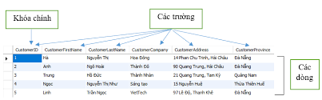
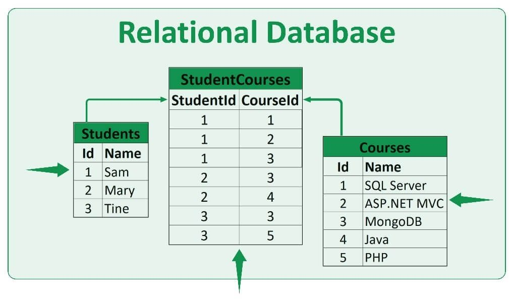
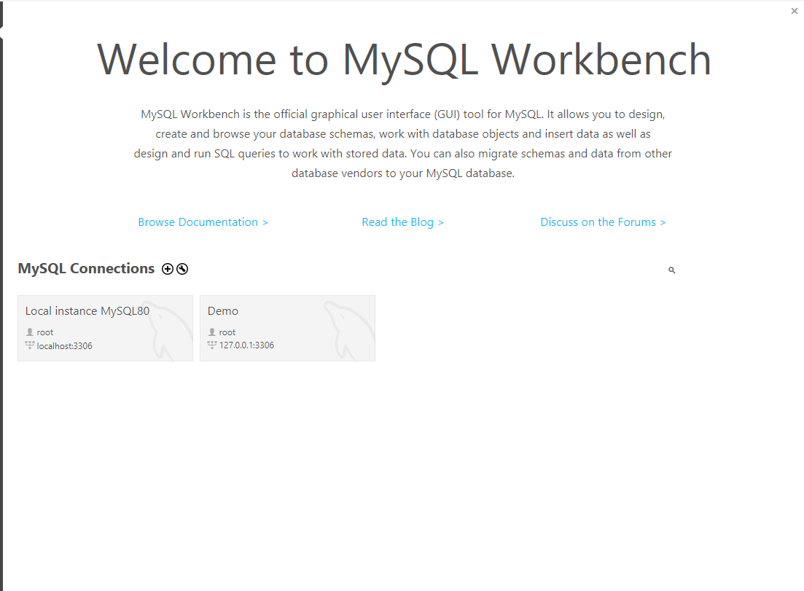
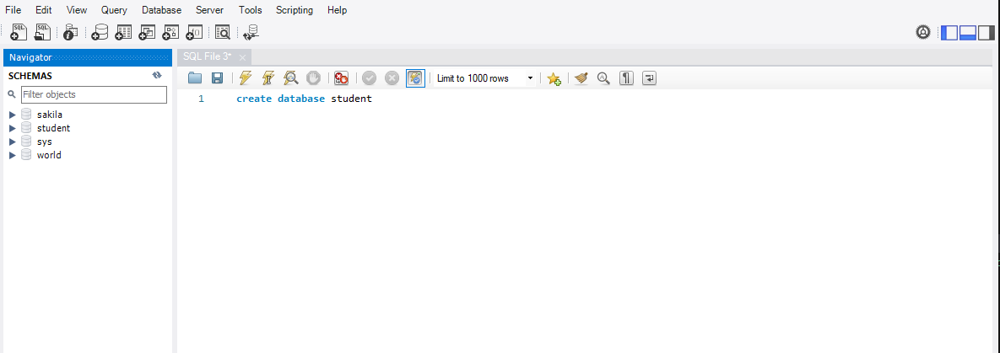
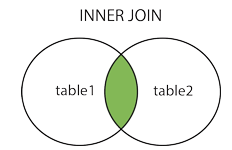
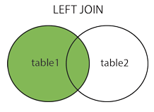
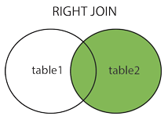

# Cơ sở dữ liệu
## 1. CSDL và CSDL quan hệ
### 1.1 CSDL
- Cơ sở dữ liệu (Database) là một tập hợp các dữ liệu rời rạc được tổ chức, lưu trữ và quản lý theo hệ thống để có thể dễ dàng truy xuất, chỉnh sửa và cập nhật. Chúng thường được sử dụng để lưu trữ thông tin trong các hệ thống phần mềm và ứng dụng. Cơ sở dữ liệu giúp các tổ chức và cá nhân tổ chức dữ liệu một cách có cấu trúc, nhằm mục đích quản lý và xử lú dữ liệu hiệu quả hơn.
- Đặc điểm của Cơ sở dữ liệu:
    - Tính tổ chức và cấu trúc: thường được tổ chức dạng bảng, đối tượng
    - Khả năng truy xuất và tìm kiếm: cho phép người dùng truy xuất và tìm kiếm dữ liệu nhanh chóng và hiệu quả thông qua các truy vấn
    - Tính nhất quán và toàn vẹn: dữ liệu luôn được đảm bảo là duy trì tính chính xác và nhất quán thông qua các ràng buộc toàn vẹn
    - Khả năng mở rộng: CSDL có thể mở rộng để xử lý khối lượng dữ liệu ngày càng tăng và đáp ứng nhu cầu của app
    - Bảo mật và quyền truy cập: CSDL cung cấp các cơ chế bảo mật để bảo vệ dữ liệu khỏi các truy cập trái phép
    - Khăn năng sao lưu và phục hồi: CSDL hỗ trợ sao lưu dữ liệu định kì và phục hồi dữ liệu khí xảu ra sự cố
    - Quản lý giao dịch: CSDL hỗ trợ quản lý giao dịch, đảm bảo rằng các thao tác trên dữ liệu được thực hiện một cách nguyên tử, nhất quán, tách biệt và bền vững
    - Khả năng hỗ trợ đồng thời: CSDL có khả năng xử lý nhiều yêu cầu và giao dịch đồng thời từ nhiều người dùng mà không làm giảm hiệu suất hoặc mất DL
    - Tính tương thích: CSDL có thể tương thích với các ứng dụng và hệ thống khác nhau
    

### 1.2 CSDL quan hệ
- Mô hình cơ sở dữ liệu quan hệ (Relational Database) là mô hình phổ biến nhất hiện nay. Dữ liệu được tổ chức trong các bảng (hay được gọi là thực thể), mỗi bảng bao gồm hàng và cột. Các bảng có thể liên kết với nhau thông qua khóa (keys)
- Trong mô hình quan hệ, dữ liệu được lưu trữ trong các bảng với định dạng cấu trúc rõ ràng, và các mối quan hệ giữa các bảng được quản lý thông qua các thuộc tính chung. Ví dụ, một cơ sở dữ liệu quan hệ có thể có một bảng lưu thông tin về khách hàng và một bảng khác lưu thông tin về đơn hàng, với khóa ngoại liên kết đơn hàng với khách hàng.
- Các thành phần bao gồm:
    - Field (Cột/Trường): là trường dữ liệu thể hiện các thuộc tính của bảng. Chẳng hạn như: tên, địa chỉ…vv.
    - Row (dòng): là dòng dữ liệu gồm các thông tin dữ liệu liên quan với nhau gọi là bảng record ( bảng ghi).
    - Cell (ô): là các ô giao giữa các dòng và cột là nơi để chứa các dữ liệu.
    - Primary Key (Khóa chính): là một hoặc nhiều trường được gộp lại để định nghĩa bảng ghi. Không được trùng và cũng không được để trống. VD: ID.

- Ưu điểm:

    - Tính linh hoạt cao trong việc quản lý và truy xuất dữ liệu nhờ vào các mối quan hệ giữa các bảng.
    - Dễ dàng thực hiện các truy vấn phức tạp bằng cách sử dụng ngôn ngữ truy vấn SQL (Structured Query Language).
- Nhược điểm:

    - Có thể gặp khó khăn với hiệu suất khi làm việc với khối lượng dữ liệu rất lớn hoặc cấu trúc dữ liệu phức tạp.
    - Đòi hỏi phải quản lý cấu trúc dữ liệu và các mối quan hệ một cách chặt chẽ

## 2. SQL
### 2.1 SQL
- Ngôn ngữ truy vấn có cấu trúc (SQL) là một ngôn ngữ lập trình phục vụ việc lưu trữ và xử lý thông tin trong cơ sở dữ liệu quan hệ.
- Cơ sở dữ liệu quan hệ lưu trữ thông tin dưới dạng bảng có các hàng và cột đại diện cho những thuộc tính dữ liệu và nhiều mối quan hệ khác nhau giữa các giá trị dữ liệu.
- Có thể sử dụng các câu lệnh SQL để lưu trữ, cập nhật, loại bỏ, tìm kiếm và truy xuất thông tin từ cơ sở dữ liệu. Cũng có thể sử dụng SQL để duy trì và tối ưu hóa hiệu suất cơ sở dữ liệu.
### 2.2 Cài đặt MySQL
- Vào trang chủ của [MySQL] (https://dev.mysql.com/downloads/file/?id=544662) để download rồi giải nén như bình thường
- Tải những gì app yêu cầu rồi finish là xong
- Khi tìm kiếm trên windown có MySQL Workbench 8.0 là cài đặt thành công
## 3. Database và Table
### 3.1 Database
- Trong MySQL, database (cơ sở dữ liệu) là một tập hợp có tổ chức của các bảng (tables) chứa dữ liệu có liên quan với nhau. Mỗi cơ sở dữ liệu trong MySQL có thể chứa nhiều bảng, và mỗi bảng bao gồm các hàng (rows) và cột (columns) để lưu trữ thông tin.

- Cách tạo Database trong MySQL
    
    - Ấn vào dấu cộng ở chỗ MySQL Connection để tạo một hệ quản trị cơ sở dữ liệu mới
    - Mọi người tạo một file truy vấn bằng cách ấn vào File -> New Query Tab
    - Tạo Database mới bằng câu lệnh `CREATE DATABASE <Tên database>`
    - 
    - Sau đó bên cột Schemas có một database mới là Student
    - Để xóa database thì dùng câu lệnh: `DROP DATABASE <Tên database cần xóa>`

### 3.2 Table
- Trong cơ sở dữ liệu (database), một table (bảng) là một cấu trúc dữ liệu dùng để tổ chức và lưu trữ dữ liệu dưới dạng hàng và cột. Mỗi bảng trong cơ sở dữ liệu bao gồm nhiều cột, mỗi cột tương ứng với một thuộc tính cụ thể, và nhiều hàng, mỗi hàng chứa một tập hợp các giá trị thuộc về các cột tương ứng.

- Các thành phần cơ bản của một bảng trong cơ sở dữ liệu:

    - Tên bảng: Tên duy nhất được sử dụng để xác định bảng trong cơ sở dữ liệu.
    - Cột (Column): Mỗi cột trong bảng biểu thị một thuộc tính của dữ liệu. Mỗi cột có một tên và kiểu dữ liệu nhất định (như INT, VARCHAR, DATE, v.v.).
    - Hàng (Row): Mỗi hàng trong bảng biểu thị một bản ghi (record) của dữ liệu. Mỗi hàng chứa các giá trị cụ thể cho các cột trong bảng.
    - Khóa chính (Primary Key): Một cột hoặc một nhóm cột mà các giá trị trong đó là duy nhất cho mỗi hàng, dùng để xác định một cách duy nhất mỗi bản ghi trong bảng.
    - Khóa ngoại (Foreign Key): Là một hoặc nhiều cột trong bảng này tham chiếu đến khóa chính của bảng khác, tạo liên kết giữa các bảng.
    - Chỉ mục (Index): Một cấu trúc dữ liệu đặc biệt giúp tăng tốc quá trình truy vấn dữ liệu trong bảng.

- Tạo bảng:
    - Cú pháp:
    ```
    CREATE TABLE database_name.table_name (
        column1 datatype,
        column2 datatype,
        column3 datatype,
        ...
    )
    ```
    - Cách nhập dữ liệu vào bảng
        - Truy cập vào bảng bằng cách chuột phải vào bảng vừa tạo -> chọn Select Rows

    ```
    INSERT INTO student_table (id, name, sđt)
    VALUES 
        (1, 'a', '123'),
        (2, 'b', '456'),
        (3, 'c', '789');

    ```

    - Cách xóa hết dữ liệu đã insert khỏi bảng
    ```
    TRUCATE TABLE table_name;
    ```

    - Thêm cột vào bảng:
    ```
    ALTER TABLE table_name
    ADD column datatype;
    ```
    - Xóa cột:
    ```
    ALTER TABLE table_name
    DROP column datatype;
    ```
    - Thay đổi datatype 1 cột
    ```
    ALTER TABLE table_name
    MODIFY column datatype
    ```

## 4. Thao tác với dữ liệu bằng INSERT, UPDATE, DELETE
### 4.1 INSERT
- Lệnh INSERT INTO trong SQL được sử dụng để thêm các hàng dữ liệu mới vào một bảng trong Database.
- Cú pháp:
```
INSERT INTO table_name (column1, column2, column3, ...)
    VALUES 
        (1, 'a', '123', ...),
        (2, 'b', '456', ...),
        (3, 'c', '789', ...),
        ...;
```

### 4.2 UPDATE
- Truy vấn UPDATE trong SQL được sử dụng để sửa đổi các bản ghi đang tồn tại trong một bảng.

- Có thể sử dụng mệnh đề WHERE với truy vấn UPDATE sửa đổi các hàng đã lựa chọn, nếu không, hệ thống sẽ mặc định là tất cả các hàng đều bị tác động.

Cú pháp:
```
UPDATE ten_bang
SET cot1 = giatri1, cot2 = giatri2...., cotN = giatriN
WHERE [dieu_kien];
```
- MySQL Safe Update Mode bắt buộc khi UPDATE hoặc DELETE phải có WHERE gắn với khóa chính (KEY column), để tránh xóa/cập nhật nhầm toàn bộ bảng.

### 4.3 DELETE
- Xóa các hàng trong bảng

- Cú pháp:

```
DELETE FROM ten_bang
WHERE [dieu_kien];
```

## 5. Truy vấn dữ liệu
### 5.1 SELECT
- Lệnh SELECT trong SQL được sử dụng để lấy dữ liệu từ một bảng trong Database mà trả về dữ liệu ở dạng bảng dữ liệu kết quả.
- Cú pháp:
```
SELECT cot1, cot2, cotN FROM ten_bang;

SELECT * FROM ten_bang;
```

### 5.2 Các câu điều kiện:
#### 5.2.1 WHERE

- Mệnh đề WHERE trong SQL được sử dụng để xác định một điều kiện trong khi lấy dữ liệu từ bảng đơn hoặc nhiều bảng kết hợp.

- Sử dụng mệnh đề WHERE để lọc các bản ghi và chỉ lấy lại các bản ghi cần thiết.

- Cú pháp:
```
SELECT cot1, cot2, cotN
FROM ten_bang
WHERE [dieu_kien]
```

- `condition` là biểu thức điều kiện để chọn lọc dữ liệu, thường có ba thành phần cơ bản: tên cột, toán tử so sánh, giá trị

| Toán tử        |    Điều kiện                                 |
| ---------- | ----------------------------------------- |
| =          | Bằng.                                     |
| >          | Lớn hơn.                                  |
| <          | Nhỏ hơn.                                  |
| >=         | Lớn hơn hoặc bằng.                        |
| <=         | Nhỏ hơn hoặc bằng.                        |
| <> hoặc != | Khác                                      |
| BETWEEN    | Nằm trong một phạm vi giá trị. `WHERE id BETWEEN 1 AND 5;`           |
| LIKE       | Tìm kiếm dựa theo mẫu chuỗi. `WHERE name LIKE 'P%';`. Ký tự đặc biệt trong LIKE: `%` → bất kỳ chuỗi ký tự nào (kể cả rỗng). `_` → đúng 1 ký tự.              |
| IN         | Nằm trong số những giá trị được chỉ định.`WHERE id IN (1, 3, 5);` |

#### 5.2.2 LIMIT

- Hạn chế số lượng bản ghi được trả về bởi câu lệnh SELECT
- Cú pháp:

  ```sql
  SELECT cot1, cot2, cotN
  FROM ten_bang
  LIMIT [number];

  -- Trong SQL Server không có lệnh LIMIT, thay bằng TOP [number] đặt sau SELECT.
  ```

#### 5.2.3 ORDER BY

- Dùng để sắp xếp dữ liệu theo thứ tự tăng dần hoặc giảm dần, dựa trên một hoặc nhiều cột.
- Cú pháp:

  ```sql
  SELECT cot1, cot2, cotN
  FROM ten_bang
  ORDER BY cot1, cot2, cotN [ASC | DESC];

  -- Sắp xếp tăng dần hoặc giảm dần. 
  ```

#### 5.2.4 GROUP BY

- Mệnh đề GROUP BY trong SQL được sử dụng kết hợp với lệnh SELECT để sắp xếp dữ liệu đồng nhất vào trong các nhóm.
- Thường được sử dụng với các hàm COUNT(), MAX(), MIN(), SUM(), AVG()
- Cú pháp:

  ```sql
  SELECT cot1, cot2
  FROM ten_bang
  WHERE [ dieu_kien ]
  GROUP BY cot1, cot2
  ```

#### 5.2.5 HAVING

- Thường được dùng với mệnh đề `GROUP BY` lọc nhóm dựa trên một điều kiện xác định sau khi nhóm
- Nếu bỏ qua mệnh đề `GROUP BY`, mệnh đề `HAVING` sẽ hoạt động giống như mệnh đề `WHERE`.
- Cú pháp:

  ```sql
  SELECT cot1, cot2
  FROM ten_bang
  WHERE [dieu_kien]
  GROUP BY cot1, cot2
  HAVING [dieu_kien]
  ORDER BY cot1, cot2;
  ```

### 5.3 Các loại JOIN

- Là phép kết nối dữ liệu từ nhiều bảng lại với nhau, nối 2 bảng, 3 bảng.. với nhau. Khi cần truy vấn các cột dữ liệu từ nhiều bảng khác nhau để trả về trong cùng một tập kết quả, dùng JOIN. 2 bảng kết nối được với nhau khi có 1 trường chung giữa 2 bảng này.

#### 5.3.1INNER JOIN



- Trả về tất cả các hàng khi có ít nhất một giá trị ở cả hai bảng
  
#### 5.3.2 LEFT OUTER JOIN (Hoặc LEFT JOIN)



- Trả lại tất cả các dòng từ bảng bên trái, và các dòng đúng với điều kiện từ bảng bên phải

#### 5.3.3 RIGHT OUTER JOIN (Hoặc RIGHT JOIN)


- Trả lại tất cả các hàng từ bảng bên phải, và các dòng thỏa mãn điều kiện từ bảng bên trái

#### 5.3.4 FULL OUTER JOIN (Hoặc OUTER JOIN)



- Trả về tất cả các dòng đúng với 1 trong các bảng.