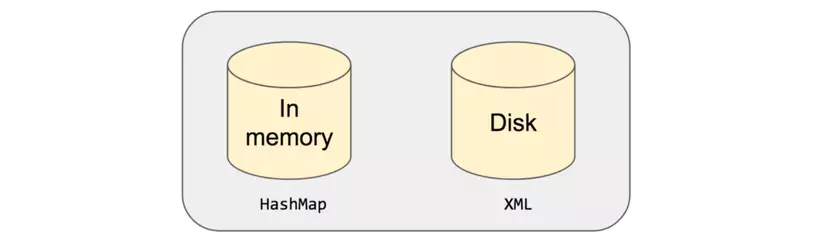

# Room Database trong Android
## 1. SQLite và MySQL
- SQLite và MySQL đều là các hệ quản trị cơ sở dữ liệu quan hệ mã nguồn mở. Có một vài điểm khác biệt chính của cả 2 hệ thống này.
* Khái niệm:
    - SQLite là hệ quản trị cở sở dữ liệu với điểm nổi bật là gọn, nhẹ, đơn giản, đặc biệt không cần mô hình server-client, không cần cài đặt, cấu hình hay khởi động nên không có khái niệm user, password hay quyền hạn. Dữ liệu cũng được lưu ở một file duy nhất
    - MySQL nổi tiếng với tốc độ nhanh, dễ sử dụng và khả năng tương thích tốt với các ứng dụng web. MySQL yêu cần một máy chủ để chạy. MySQL cần có kiến trúc client-sever để tương tác qua mạng

* Hỗ trợ kiểu dữ liệu:
- SQLite hỗ trợ các kiểu dữ liệu: Blob, Integer, Null, Text, Real.

- MySQL hỗ trợ các kiểu dữ liệu sau:

    - Tinyint, Smallint, Mediumint, Int, Bigint, Double, Float, Real, Decimal, Double precision, Numeric, Timestamp, Date, Datetime, Char, Varchar, Year, Tinytext, Tinyblob, Blob, Text, MediumBlob, MediumText, Enum, Set, Longblob, Longtext.

- Như bạn có thể thấy, MySQL linh hoạt hơn nhiều khi nói đến kiểu dữ liệu.

* Lưu trữ:
- Thư viện SQLite có kích thước khoảng 250 KB, trong khi máy chủ MySQL có kích thước khoảng 600 MB. SQLite trực tiếp lưu thông tin vào một tệp duy nhất, giúp dễ dàng sao chép. Không yêu cầu cấu hình phức tạp, và quá trình này có thể thực hiện với sự hỗ trợ tối thiểu.

- Trước khi sao chép hoặc xuất MySQL, bạn cần nén nó thành một tệp duy nhất. Đối với các cơ sở dữ liệu lớn hơn, điều này sẽ mất nhiều thời gian.

* Truy cập:
- SQLite: Không hỗ trợ tốt nhiều người dùng. Nếu hai người dùng cố gắng ghi dữ liệu cùng lúc, cơ sở dữ liệu sẽ bị khóa trong thời gian ngắn. Nó không có chức năng quản lý người dùng cụ thể.
- MySQL: Một trong những thế mạnh lớn nhất của nó là hỗ trợ nhiều người dùng. Bạn có thể gán quyền cụ thể cho từng người dùng, và nhiều người dùng có thể ghi vào các tệp khác nhau đồng thời mà không gặp vấn đề. MySQL có hệ thống quản lý người dùng được xây dựng tốt

* Khả năng mở rộng:
- SQLite: Lý tưởng cho các dự án nhỏ không yêu cầu nhiều người dùng. Nó không thể xử lý lượng lớn dữ liệu cùng lúc; khi dung lượng vượt quá giới hạn, hiệu suất của SQLite sẽ giảm sút. Việc tối ưu hóa hiệu suất khó hơn khi sử dụng SQLite cho cơ sở dữ liệu lớn.
- MySQL: Dễ dàng mở rộng để đáp ứng nhu cầu của người dùng. Nó có thể xử lý cơ sở dữ liệu lớn hơn với ít nỗ lực hơn. Tuy nhiên, để mở rộng, bạn có thể cần mua thêm phần cứng.

* Bảo mật:
- SQLite: Không có cơ chế xác thực tích hợp. Các tệp cơ sở dữ liệu có thể được truy cập bởi bất kỳ ai.
- MySQL: Đi kèm với nhiều tính năng bảo mật tích hợp, bao gồm xác thực bằng tên người dùng, mật khẩu và SSH.

* Trường hợp sử dụng
- SQLite lý tưởng cho:
    ◦ Phát triển các ứng dụng độc lập nhỏ.
    ◦ Các dự án nhỏ không yêu cầu nhiều khả năng mở rộng.
    ◦ Khi bạn cần đọc và ghi trực tiếp từ đĩa.
    ◦ Phát triển và kiểm thử cơ bản.
    ◦ Các trang web có dưới 100 lượt truy cập mỗi ngày và không yêu cầu nhiều người dùng.
- MySQL là lựa chọn ưu việt cho:
    ◦ Các ứng dụng truy cập bởi nhiều người dùng.
    ◦ Khi người dùng yêu cầu các tính năng bảo mật và xác thực mạnh mẽ.
    ◦ Với các hệ thống phân tán.
    ◦ Với các ứng dụng yêu cầu cơ sở dữ liệu lớn hơn và khả năng mở rộng cao.
    ◦ Các ứng dụng dựa trên web.
    ◦ Phát triển các giải pháp tùy chỉnh.
    ◦ Hầu hết các trang web tiêu chuẩn (blog, thương mại điện tử, v.v.).
    ◦ Các trang web có hơn 100 lượt truy cập mỗi ngày và/hoặc yêu cầu nhiều người dùng.

## 2. Room Database - Cách tạo Room Database trong Android
### 2.1 Room Database
- Room Database là một phần trong Android Architecture Components
- Room database được phát triển và cải tiến từ sqlite. Room database giúp đơn giản hoá việc code,và giảm thiểu các công đoạn liên quan đến cơ sở dữ liệu.

- Bản chất Room database là abstract layer gồm cơ sở dữ liệu chuẩn SQLite được Android thông qua.

* Các thành phần bên trong của room database:


- Mô tả các thành phần:
    - Lớp database lưu giữ cơ sở dữ liệu và đóng vai trò là điểm truy cập chính cho đường kết nối cơ bản đến dữ liệu cố định của ứng dụng.
    - Data entities biểu thị các bảng trong cơ sở dữ liệu của ứng dụng.
    - Data access objects (DAOs) cung cấp các phương thức mà ứng dụng của bạn có thể dùng để truy vấn, cập nhật, chèn và xoá dữ liệu trong cơ sở dữ liệu.

* Entities:
- Entity đại diện cho một bảng trong cơ sở dữ liệu, Class này được annotated bằng chú thích `@Entity`. Các trường dữ liệu trong clas này đại diện cho các cột trong bảng
```kotlin
@Entity
data class User(
  @PrimaryKey val uid: Int,
  @ColumnInfo(name = "first_name") val firstName: String?,
  @ColumnInfo(name = "last_name") val lastName: String?
)
```

- Các annotation:

    - *@Entity*: Phải khai báo annotation này trước mỗi Entity để Room hiểu rằng đây là một Entity, và vì vậy nó sẽ giúp tạo ra một Table bên trong cơ sở dữ liệu. Trong khi sử dụng annotation @Entity này, chúng ta cũng sẽ sử dụng đến thuộc tính tableName để chỉ định tên của Table
    - *@PrimaryKey*: Giúp định nghĩa khóa chính của Table. Có thuộc tính autoGenerate để cho phép hệ thống tự tạo ra giá trị id
    - *@ColumnInfo*: Kết hợp với thuộc tính kèm theo là name để đặt lại tên cho Column (cột) của Table. Nếu không khai báo ColumnInfo, khi đó Room sẽ lấy tên của thuộc tính làm tên của Column.
- Tất cả các trường trong một Entity phải là công khai hoặc có phương thức getter và setter
- Entity class phải có một phương thức khởi tạo trống (Nếu tất cả các trường đều có thể truy cập được) hoặc một phương thức khởi tạo được tham số hóa nhận tất cả các trường. Room cũng có thể sử dụng một phần constructors
- Mỗi entity class phải có ít nhất một khóa chính. Bạn có thể sử dụng annotated `@PrimaryKey` để xác định khóa chính của một trường hoặc thuộc tính primaryKey của chú thích `@Entity` cho nhiều trường.
```kotlin
@Entity(primaryKeys = arrayOf("firstName", "lastName"))
```
- Theo mặc định, Room sử dụng tên lớp làm tên bảng cơ sở dữ liệu. Nếu bạn muốn bảng có tên khác, hãy đặt thuộc tính tableName của chú tích `@Entity`. Tương tự, bạn có thể sử dụng thuôvj tính name của chú thích `@ColumnInfo` để xác định tên của các cột.
```kotlin
@Entity(tableName = "users")
```
- Nếu bạn không muốn duy trì bất kỳ trường nào, bạn có thể chú thích chùng bằng cách sử dụng `@Ignore`
```kotlin
@Ignore val picture: Bitmap?

```

- Bạn có thể sử dụng thuộc tính chủ số của annotated `@Entity` để thêm chỉ số vào một entity. Ngoài ra, bạn có thể tạo các chỉ mục duy nhất bằng cách đặt thuộc tính duy nhất của chú thích `@Index` thành true

```kotlin
@Entity(indices = arrayOf(Index(value = ["last_name", "address"])))@Entity(indices = arrayOf(Index(value = ["first_name", "last_name"],
    unique = true)))
```

* Data Access Object (DAO)
- DAO cung cấp một API để truy cập cơ sở dữ liệu. Đây là giao diện được chú thích bằng chú thích `@Dao`. Tất cả các phương thức trong giao diện này được sử dụng để lấy dữ liệu từ cơ sở dữ liệu hoặc thực hiện các thay đổi đối với cơ sở dữ liệu. Các phương thức này được chú thích bằng các chú thích như `@Query`, `@Insert`, `@Delete`.

```kotlin
@Dao
interface UserDao {
  @Query("SELECT * FROM user")
  fun getAll(): List<User>
  
  @Query("SELECT * FROM user WHERE uid IN (:userIds)")
  fun loadAllByIds(userIds: IntArray): List<User>
  
  @Insert
  fun insertAll(vararg users: User)
  
  @Delete
  fun delete(user: User)
}
```
- Các annotation:

    - *@Dao*: giúp Room hiểu rằng đây là một DAO và sẽ hành xử với các phương thức đi kèm nó với các annotation.
    - *@Insert, @Update, @Delete*: Là các annotation liên quan đến các chức năng thêm, sửa, xóa đối với các table của cơ sở dữ liệu.
        - phương thức insert() của mình nên đi kèm với annotation @Insert.
        - Phương thức delete() đi kèm với annotation @Delete.
    - *@Query*: Giúp viết các câu truy vấn vào trong đó.

* Type Converters:
- Đôi khi, bạn có thể cần phải duy trì một kiểu dữ liệu tùy chỉnh trong một cột cơ sở dữ liệu. Bạn có thể sử dụng bộ chuyển đổi kiểu cho các trường hợp sử dụng kiểu này.
```kotlin
class Converters {
  @TypeConverter
  fun fromTimestamp(value: Long?): Date? {
  return value?.let { Date(it) }
  }

  @TypeConverter
  fun dateToTimestamp(date: Date?): Long? {
  return date?.time?.toLong()
  }
}

```
- Tiếp theo, bạn phải thêm chú thích @TypeConverters vào lớp RoomDatabase để Room có thể sử dụng trình chuyển đổi mà bạn đã xác định cho từng entity và DAO trong RoomDatabase đó.
```kotlin
@Database(entities = arrayOf(User::class), version = 1)
@TypeConverters(Converters::class)
abstract class UserDatabase : RoomDatabase() {
    abstract fun userDao(): UserDao
}

```

### 2.2 Các tạo Room Database
- B1: Import các thư viện cần thiết
    - Phần Dependencies :
    ```kotlin
    dependencies {
        ....

    implementation("androidx.room:room-runtime:$room_version")
    ksp("androidx.room:room-compiler:$room_version")

    }
    ```

    - Phần plugin của gradle/app
    ```kotlin
    plugins {
    id("com.android.application")
    id("org.jetbrains.kotlin.android")
    id("com.google.devtools.ksp") version "2.0.0-1.0.21"
    }
    ```

- B2: Tạo Room Entities
```kotlin
package com.example.testing

import androidx.room.Entity
import androidx.room.PrimaryKey

@Entity(tableName = "items")
data class Item(
    @PrimaryKey(autoGenerate = true)
    val id: Long = 0L,
    val name: String?,
    val description: String?,
    val quantity: Long?
)
```

- B3: Tạo DAO Interface
- Có thể thêm các truy vẫn ở đây
```kotlin
package com.example.testing

import androidx.room.Dao
import androidx.room.Delete
import androidx.room.Insert
import androidx.room.Update

@Dao
interface ItemDAO {
    @Insert
    suspend fun insert(vararg items: Item)  

    @Update
    suspend fun update(vararg items: Item)

    @Delete
    suspend fun delete(item: Item)

     @Query("SELECT * FROM items")
    suspend fun getAllItems(): List<Item>
}

```
- B4: Tạo Database
```kotlin
package com.example.testing.data

import android.content.Context
import androidx.room.Database
import androidx.room.Room
import androidx.room.RoomDatabase
import com.example.testing.Item

@Database(entities = [Item::class], version = 1, exportSchema = false)
abstract class ItemDatabase : RoomDatabase() {

    abstract fun itemDao(): ItemDAO

    companion object {
        @Volatile
        private var INSTANCE: ItemDatabase? = null

        fun getDatabase(context: Context): ItemDatabase {
            return INSTANCE ?: synchronized(this) {
                val instance = Room.databaseBuilder(
                    context.applicationContext,
                    ItemDatabase::class.java,
                    "item_database"
                ).build()
                INSTANCE = instance
                instance
            }
        }
    }
}
```
-   `@Database(entities = [Item::class], version = 1)`     → khai báo Item là bảng.

-   `abstract fun itemDao(): ItemDAO`  → để Room generate code.

-   `companion object với @Volatile + synchronized`    → đảm bảo singleton (chỉ 1 instance DB trong app).

-   `Room.databaseBuilder` tạo DB tên "item_database".
- B5: Dùng Database
```kotlin

class MainActivity : AppCompatActivity() {
    override fun onCreate(savedInstanceState: Bundle?) {
        super.onCreate(savedInstanceState)
        enableEdgeToEdge()
        setContentView(R.layout.activity_main)

        ViewCompat.setOnApplyWindowInsetsListener(findViewById(R.id.main)) { v, insets ->
            val systemBars = insets.getInsets(WindowInsetsCompat.Type.systemBars())
            v.setPadding(systemBars.left, systemBars.top, systemBars.right, systemBars.bottom)
            insets
        }

        val db = ItemDatabase.getDatabase(this)
        val itemDao = db.itemDao()

        CoroutineScope(Dispatchers.IO).launch {
            val newItem = Item(
                id = 0,
                name = "Bút bi",
                description = "Bút bi Thiên Long",
                quantity = 10
            )
            itemDao.insert(newItem)

            val list: List<Item> = itemDao.getAllItems()

            withContext(Dispatchers.Main) {
                println("Danh sách items: $list")
            }
        }

    }
}

```
- Coroutine: là lightweight thread (nhẹ hơn thread thật), cho phép chạy song song hoặc bất đồng bộ mà không block UI.

- Dispatchers.IO: cho biết coroutine sẽ chạy trên thread pool dành cho I/O (dùng cho database, network, đọc file).

- launch { ... }: khởi chạy coroutine không trả về kết quả (nếu muốn có kết quả thì dùng async).

## 3. Relatiónhip trong Room và cách sử dụng
### 3.1 Quan hệ 1-1
- Ta có một bảng là Dog và 1 bảng là Owner. Trong đó, table Dog có tham chiếu đến id của Owner hoặc Owner tham chiếu đến id của Dog. Tức là 1 Id Dog chỉ có 1 Id của Owner tham chiếu đến

```kotlin
@Entity
data class Dog(
    @PrimaryKey val dogId: Long,
    val dogOwnerId: Long,
    val name: String,
    val cuteness: Int,
    val barkVolume: Int,
    val breed: String
)

@Entity
data class Owner(@PrimaryKey val ownerId: Long, val name: String)

```

- Trong trường hợp chúng ta muốn hiển thị list tất cả Dog và Owner của nó trong một màn hình. Để làm được điều này, chúng ta cần tạo một table DogAndOnwer data class:
```kotlin
data class DogAndOwner(
    val owner: Owner,
    val dog: Dog
)

```

- Bước tiếp theo với SQLite, chúng ta phải cần:
    - Thực hiện 2 query: một cho get tất cả các Owners, và một cho get tất cả các Dogs dựa trên những Id có được từ query trước đó.
    - Sau đó, phải handle mapping các object đó:
    ```kotlin
    interface DogOwnerDao {
    @Query("""
        SELECT * FROM Owner 
        INNER JOIN Dog ON Owner.ownerId = Dog.dogOwnerId 
        WHERE Dog.dogOwnerId IN (:ownerIds)
    """)
    suspend fun getDogsAndOwners(ownerIds: List<Long>): List<DogAndOwner>
}
    ```

- Trong khi đó ở ROOM , chúng ta không cần phải thực hiện 2 query và phải xử lý mapping, thay vào đó chỉ cần thêm @Relation annotation.
- Trong ví dụ này, khi mà table Dog đã có thông tin owner của nó, chúng ta sẽ thêm @Relation annotation vào dog variable để xác định rằng column trên parent (Owner entity) tương ứng với dogId đó.
```kotlin
data class DogAndOwner(
    @Embedded val owner: Owner,
    @Relation(
         parentColumn = "ownerId",
         entityColumn = "dogOwnerId"
    )
    val dog: Dog
)
```

- Và bây giờ, chỉ cần một query đơn giản ở DAO :

```kotlin
@Transaction
@Query("SELECT * FROM Owner")
fun getDogsAndOwners(): List<DogAndOwner>
```

### 3.2 Quan hệ 1-many
- Trường hợp này, khi Dogs có nhiều Owners chúng ta cần phải có nhiều entry cho cùng một dogOwnerId của Dogs, ứng với các ownerId khác nhau. Vì dogIId là khóa chính trong Dog, chúng ta không thể insert nhiều Dogs với chung id. Để khắc phục điều này chúng ta sẽ tạo ra table kết hợp (bảng phụ tham chiếu chéo) giữa các cặp (dogId,ownerId)

```kotlin
@Entity(primaryKeys = ["dogId", "ownerId"])
data class DogOwnerCrossRef(
    val dogId: Long,
    val ownerId: Long
)
```
- Trong ROOM, chúng ta sẽ cần update lại table OwnerWithDogs và thông báo cho ROOM rằng để get được Dogs, nó cần sử dụng bảng phụ DogOwnerCrossRef. Chung ta tạo tham chiếu với table này bằng cách sử dụng một Junction:

```kotlin
data class OwnerWithDogs(
    @Embedded val owner: Owner,
    @Relation(
         parentColumn = "ownerId",
         entityColumn = "dogId",
         associateBy = Junction(DogOwnerCrossRef::class)
    )
    val dogs: List<Dog>
)
```
DAO:
```kotlin
@Transaction
@Query("SELECT * FROM Owner")
fun getOwnersWithDogs(): List<OwnerWithDogs>
```

## 4. SharedPreferences
- Shared Preferences là nơi bạn có thể lưu trữ các thông tin dưới dạng key-value được xây dựng sẵn trong hệ điều hành Android.

- Đoạn code dưới đây sẽ lấy một instance của shared preferences với tên truyền vào. instance đó có thể được sử dụng trong phạm vi toàn bộ ứng dụng bất cứ đâu nó được lấy về.

```kotlin
val pref = getSharedPreferences("PREF", MODE_PRIVATE)

```


- Không quan trọng trong context nào (Activity, Fragment, Application, ...) mà nó được gọi, nó luôn luôn trả về instance giống nhau khi bạn gọi method trên với tên giống nhau. Điều này đảm bảo rằng bạn luôn luôn nhận được dữ liệu mới nhất được lưu.

### 4.1 Cấu trúc bên trong
- Bạn có thể hình dung cấu trúc bên trong Shared Preferences là một bộ nhớ in-memory (RAM) đặt trên một bộ nhớ disk-storage (External Storage). Mọi thao tác đều đi qua bộ nhớ in-memory đầu tiên sau đó mới đến disk-storage trong trường hợp cần thiết.

- Bộ nhớ In-Memory về bản chất là một Hash-Map, điều đó cho phép các thao tác đều có độ phức tạp là O(1) khi chạy.



### 4.2 Lấy dữ liệu 
- Tất cả các thao tác được đi qua bộ nhớ In-Memory, điều đó có nghĩa là ngay lập tức và tránh được các thao tác I/O. Bởi vì tất cả các thao tác đi qua bộ nhớ in-memory nên nó đảm bảo rằng giá trị trả về sẽ là giá trị mới nhất.
- `val value = pref.getString(key, null)` trả về dữ liệu theo key, nếu không có sẽ trả về null

- Chú ý rằng nếu lần đầu dữ liệu được tải lên, nó sẽ đợi cho đến khi dữ liệu được loaded vào bộ nhớ in-memory từ disk storage.

### 4.3 Lưu dữ liệu qua `commit()`
- Lưu dữ liệu vào in-memory trước sau đó thực hiện ghi vào disk một cách đồng bộ. Bởi vì có sự tham gia của thao tác I/O, main thread sẽ bị blocked cho đến khi data được ghi hết vào disk storage. Đây là một thao tác kém hiệu quả so với apply()

- Bởi vì thao tác ghi dữ liệu lên disk storage là đồng bộ cho nên trạng thái trả về sẽ là một biến boolean. Do đó bạn có thể xác nhận rằng liệu thao tác mà bạn thực hiện có thành công hay không bằng cách kiểm tra kết quả trả về.

`val result = pref.edit().putString(key, "value").commit()`


### 4.4 Lưu dữ liệu bằng `apply()`
- Lưu giá trị vào in-memory trước sau đó ghi dữ liệu một cách bất đồng bộ vào disk-storage. Main thread sẽ không bị blocked và không phải đợi thao tác trên disk nữa. Tuy thao tác ghi lên disk storage là asynchronous nhưng bất kỳ thao tác read ngay sau lời gọi apply() sẽ đều trả về kết quả là mới nhất bởi vì thao tác read (get) sẽ được thực thi thông qua in-memory.

- Bởi vì thao tác ghi dữ liệu lên disk-storage là asynchronous, sẽ không có giá trị nào được trả về. Do đó bạn không thể xác nhận được là liệu thao tác bạn thực thi có thành công hay không,

- Hãy sử dụng apply trừ khi bạn bạn cần xác nhận kết quả của thao tác bạn thực hiện.

`pref.edit().putString(key, "value").apply()`


