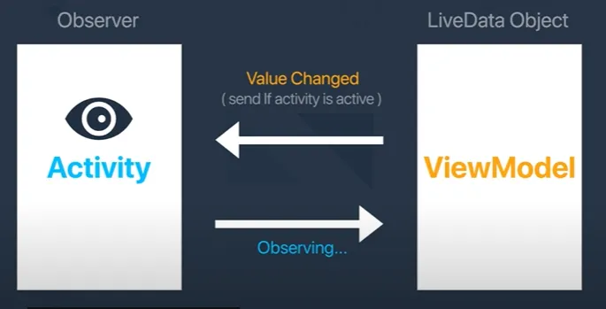
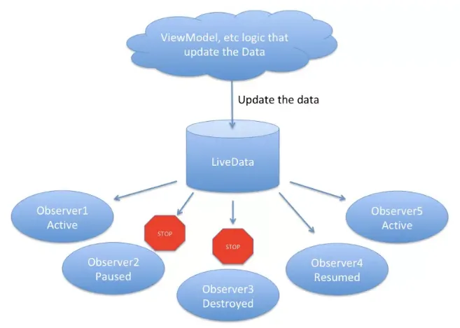
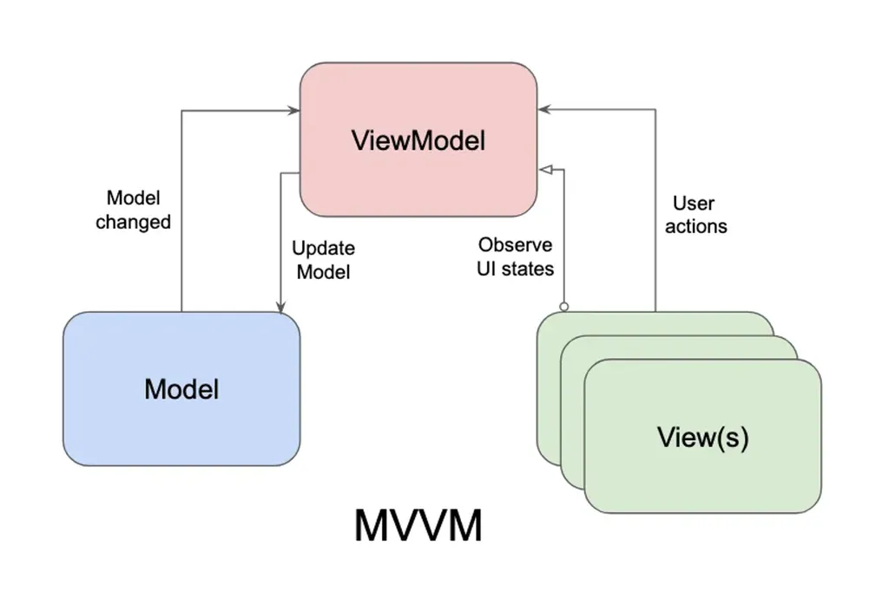

# ViewModel, LiveData và Kiến trúc MVVM
## 1. ViewModel

### 1.1 Giới thiệu về ViewModel
- `ViewModel` là một class có trách nhiệm chuẩn bị và quản lý dữu liệu cho một UI component (Có thể là Activity hoặc Fragment). Nó cũng cung cấp cách để dễ dàng giao tiếp giữa Activity và Fragment hoặc giữa các Fragment với nhau

- `ViewModel` có ưu điểm chính là khả năng lưu trạng thái vào bộ nhớ đệm và duy trì trạng thái đó khi có các thay đổi về cấu hình. Điều này có nghĩa là giao diện người dùng không phải tìm nạp lại dữ liệu khi di chuyển giữa các hoạt động hoặc áp dụng các thay đổi về cấu hình (Ví dụ như xoay màn hình)

### 1.2 Lợi ích của ViewModel
- `ViewModel` tồn tại khi quay màn hình hoặc các configuration change khác.
- `ViewModel` vẫn running trong khi activity đang trong back stack.
- `ViewModel` là lifecycle-aware.
- `ViewModel` với sự hỗ trợ của LiveData có thể phản ứng lại sự thay đổi của UI. Mỗi khi data thay đổi, UI sẽ được cập nhật dựa trên sự quan sát LiveData với data hiện tại trong ViewModel.
- `ViewModel` dễ dàng hiểu và dễ testing.

### 1.3 Vòng đời của ViewModel

- ViewModel luôn được tạo cùng một phạm vi (Một fragment hoặc activity) và sẽ được giữ lại cho đến khi phạm vi đó còn "sống". Hay nói cách khác là `ViewModel` sẽ không bị destroyed khi activity hoặc fragment của nó bị destroyed bởi một configuration change (Ví dụ như xoay màn hình). `ViewModel` vẫn nằm trong bộ nhớ cho đến khi `ViewModelStoreOwner` chứa lớp này biến mất.


* Xóa bỏ thành phần phụ thuộc vào ViewModel
    - `ViewModel` gọi phương thức `onCleared()` khi `ViewModelStoreOwner` hủy bỏi phương thức đó trong vòng đời
    - viewModelScope là một CoroutineScope tích hợp sẵn tự động theo vòng đời của ViewModel. ViewModel có thể nhận được CoroutineScope dưới dạng phần phụ thuộc trong hàm khởi tạo. Khi ViewModelStoreOwner xoá ViewModel vào lúc kết thúc vòng đời, ViewModel cũng sẽ huỷ CoroutineScope.
    ```kotlin
    class MyViewModel(
    private val coroutineScope: CoroutineScope =
        CoroutineScope(SupervisorJob() + Dispatchers.Main.immediate)
    ) : ViewModel() {

        // Other ViewModel logic ...

        override fun onCleared() {
            coroutineScope.cancel()
        }
    }
    ```

### 1.4 Cách tạo một ViewModel
- B1: Import vào dependences trong Module.app
```kotlin
    implementation("androidx.lifecycle:lifecycle-viewmodel-ktx:2.2.0")
```

- B2: Tạo một class SampleViewModel kế thừa từ ViewModel. Tạo một LiveData để có thể truyền từ ViewModel và đưa vào View
```kotlin
    package com.example.myapplication

import androidx.lifecycle.LiveData
import androidx.lifecycle.MutableLiveData
import androidx.lifecycle.ViewModel

class SampleViewModel : ViewModel() {
    private val cnt = MutableLiveData<Int>()
    var num = 0;

    val getCnt: LiveData<Int> get() = cnt

    fun increament() {
        cnt.postValue(++num)
    }
    override fun onCleared() {
        super.onCleared()
    }
}
```

- B3: Giao tiếp với ViewModel trong View của Activity
```kotlin
package com.example.myapplication

import android.os.Bundle
import android.view.LayoutInflater
import android.widget.Toast
import androidx.activity.enableEdgeToEdge
import androidx.annotation.MainThread
import androidx.appcompat.app.AppCompatActivity
import androidx.core.view.ViewCompat
import androidx.core.view.WindowInsetsCompat
import androidx.lifecycle.Observer
import androidx.lifecycle.ViewModelProvider
import com.example.myapplication.databinding.ActivityMainBinding

class MainActivity : AppCompatActivity() {

    lateinit var viewModel: SampleViewModel
    private lateinit var binding : ActivityMainBinding
    override fun onCreate(savedInstanceState: Bundle?) {
        super.onCreate(savedInstanceState)
        binding = ActivityMainBinding.inflate(layoutInflater)
        enableEdgeToEdge()
        setContentView(binding.root)
        ViewCompat.setOnApplyWindowInsetsListener(findViewById(R.id.main)) { v, insets ->
            val systemBars = insets.getInsets(WindowInsetsCompat.Type.systemBars())
            v.setPadding(systemBars.left, systemBars.top, systemBars.right, systemBars.bottom)
            insets
        }
        viewModel = ViewModelProvider(this).get(SampleViewModel::class.java)
        obverse()
        initListeners()
    }

    fun initListeners() {
        binding.btn.setOnClickListener {
            viewModel.increament()
        }
    }

    fun obverse(){
        viewModel.getCnt.observe(this, Observer{
            showToast(it)
        })
    }

    private fun showToast(value: Int) {
        Toast.makeText(this, value.toString(), Toast.LENGTH_LONG).show()
    }
}
```

- Mỗi khi data thay đổi của cnt qua LiveData, chúng ta sẽ nhận callback thông qua `Observer` đẵ đăng kí, cho nên UI của chúng ta luôn được update và nhận giá trị mới nhất


* `ViewModelProvider.Factory`
    - Như trên thì `ViewModel` của chúng ta không nhận bất kì tham số nào
    - Khi có tham số thì cần `ViewModelFactory` để làm
    - `ViewModelProvider()` tạo một `ViewModelProvider.Factory` mặc định, với `ViewModelProvider.Factory` này chúng ta sẽ không thể tạo `ViewModel` với tham số. Vì vậy, khi chúng ta thêm tham số vào constructor của `ViewModel`, thì việc thực hiện `ViewModelProvider.Factory` sẽ bị lỗi vì nó sẽ gọi primary constructor cho việc tạo instance của `ViewModel`.
    - ViewModelProvider.Factory là việc thực hiện của factory interface, chiụ trách nhiệm khởi tạo ViewModel. Chúng ta cần implement lại factory để có thể tạo ViewModel với tham số.

Để làm điều này, chúng ta sẽ kết thừa từ ViewModelProvider.Factory và override phương thức create() cái sẽ tạo instance của ViewModel.

```kotlin
package com.example.viewmodel

import androidx.lifecycle.ViewModel
import androidx.lifecycle.ViewModelProvider

class SampleViewModelFactory (val arg: String): ViewModelProvider.Factory {

    override fun <T : ViewModel?> create(modelClass: Class<T>): T {
        return   modelClass.getConstructor(String::class.java).newInstance(arg)
    }
}

```

- modelClass.getConstructor(String::class.java) sẽ get một constructor với kiểu String và tạo một instance của ViewModel bằng việc gọi phương thức newInstance() và truyền giá trị constructor vào phương thức này.

```kotlin
class MainActivity : AppCompatActivity() {

    lateinit var viewModel: SampleViewModel

    override fun onCreate(savedInstanceState: Bundle?) {
        super.onCreate(savedInstanceState)
        setContentView(R.layout.activity_main)
        val factory = SampleViewModelFactory("sample")
        viewModel = ViewModelProvider(this,factory).get(SampleViewModel::class.java)
    }
}

```

- Nếu ViewModel của bạn có một phụ thuộc hoặc tham số và bạn muốn tạo instance của nó thì bạn cần tạo custom của ViewModelProvider.Factory để truyền phụ thuộc hoặc tham số đó vào.

```kotlin
val factory = SampleViewModelFactory("sample")
ViewModelProvider(this,factory).get(SampleViewModel::class.java)

```

- Nếu chỉ cần dùng đơn giản thông qua ViewModelProvider(this) để tạo instance của ViewModel

```kotlin
ViewModelProvider(this).get(SampleViewModel::class.java)
```

### 1.5 ViewModel Scope
- **ViewModelScope** là một phạm vi coroutine được định nghĩa cho mỗi ViewModel trong ứng dụng Android. Khi bạn khởi chạy một coroutine trong phạm vi này, nó sẽ tự động bị hủy nếu ViewModel bị xóa. Điều này rất hữu ích cho các công việc chỉ cần thực hiện khi ViewModel đang hoạt động.

- ViewModelScope giúp quản lý và dọn dẹp các coroutine, tránh lãng phí tài nguyên và ngăn ngừa rò rỉ bộ nhớ. Nó thường được sử dụng cùng với `viewModelScope.launch { }` để thực hiện các tác vụ không đồng bộ trong ViewModel
## 2. LiveData
### 2.1 LiveData là gì

- LiveData là một lớp giữ dữ liệu quan sát được. Không giống như một thiết bị quan sát thông thường, LiveData nhận biết vòng đời, có nghĩa là nó tôn trọng vòng đời của các thành phần ứng dụng khác, chẳng hạn như các activities, fragments hoặc services. Nhận thức này đảm bảo LiveData chỉ cập nhật các thành phần ứng dụng quan sát nó khi những thành phần này đang ở trạng thái hoạt động

- Mô hình Observer: được xây dựng với ý tưởng sẽ có một đối tượng trung tâm (Subject), đối tượng trung tâm này nắm danh sách các đối tượng quan sát khác ( Observer). Để rồi khi có bất kỳ thay đổi nào với trạng thái của đối tượng trung tâm đó, nó sẽ thông báo ngay cho các đối tượng quan sát được biết.
  - Các Subject: các ViewModel
  - Các Observer: các Component (Activity, Fragment, Service)
  

- LiveData nhận biết vòng đời: Nó tôn trọng vòng đời của các Component (Activities, Fragment hoặc Service) -> Đảm bảo LiveData chỉ cập nhận các thành phần quan sát nếu nó đang ở trong trạng thái hoạt động


- LiveData thực tế chỉ là một Abstract Class. Vì vậy, nó không thể được sử dụng như chính nó.May mắn thay, Google đã triển khai một số lớp cụ thể đơn giản mà chúng ta có thể sử dụng.

* **MutableLiveData**:
  - Đây là LiveData đơn giản nhất, nó sẽ được cập nhật và thông báo cho người quan sát của nó.
  - Khai báo:
  ```kotlin
    val liveDataA = MutableLiveData<String>()
    liveDataA.value = someValue

  ```
  - Để quan sát LiveData:
  ```kotlin
    class MutableLiveDataFragment : Fragment() {

        private val changeObserver = Observer<String> { value ->
            value?.let { txt_fragment.text = it }
        }

        override fun onAttach(context: Context?) {
            super.onAttach(context)
            getLiveDataA().observe(this, changeObserver)
        }
        // .. some other Fragment specific code ..
    }

  ```

## 3. Kiến trúc MVVM
- Kiến trúc MVVM (Model-View-ViewModel) là một mô hình kiến trúc phổ biến trong phát triển ứng dụng Android. Nó giúp tách biệt mạnh mẽ giữa các thành phần logic, dữ liệu và giao diện người dùng, từ đó tạo ra mã dễ quản lý, kiểm thử và bảo trì hơn. 

- - Các thành phần trong kiến trúc MVVM:
    - **Model:** Đại diện cho dữ liệu và logic liên quan đến dữ liệu. **Model** thường đảm nhận trách nhiệm lấy dữ liệu từ nguồn dữ liệu như **database**, **API** hoặc bất kỳ nguồn dữ liệu nào khác, sau đó cung cấp dữ liệu cho **ViewModel** để hiển thị lên giao diện người dùng.
    - **View**: Đại diện cho giao diện người dùng. Nó không nên chứa **business logic** hay truy vấn dữ liệu trực tiếp. Thay vào đó, nó tập trung vào việc hiển thị dữ liệu và tương tác với người dùng. **View** có thể là các thành phần như **Activity**, **Fragment** hoặc **custom View**.
    - **ViewModel**: là lớp trung gian giữa **Model** và **View**. Nhiệm vụ chính của **ViewModel** là cung cấp dữ liệu và hành vi cho giao diện người dùng.
        - **ViewModel** không biết gì về **View** cụ thể mà nó đang phục vụ, điều này giúp tái sử dụng **business logic** và dữ liệu giữa các giao diện khác nhau.
        - **ViewModel** thường xử lý các yêu cầu từ **View** và cập nhật dữ liệu trong **Model** khi cần.
        - một **ViewModel** có thể được sử dụng cho nhiều View (one-to-many)
