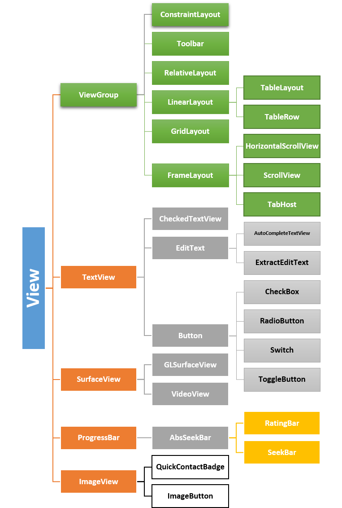

# Android Overview & Basic Layout
## 1. Android Overview
### 1.1 Giới thiệu về hệ điều hành android và IDE Android Studio
- Android là một hệ điều hành dựa trên nền tảng Linux được thiết kế dành cho các thiết bị di động có màn hình cảm ứng như điện thoại và tablet. Ban đầu. Android được phát triển bởi Android Inc sáng lập bởi (Andy Rubin, Rich Miner, Nick Sears, Chris White tại Califonia - Hoa Kỳ) với sự tài trợ của Google, được Google mua đứt vào 2005
- Android ra mắt chính thức vào ngày 5 tháng 11 năm 2007, cùng với sự thành lập của Liên minh thiết bị cầm tay mở (Open Handset Alliance), một hiệp hội gồm nhiều công ty phần cứng, phần mềm và viễn thông. Chiếc điện thoại đầu tiên chạy Android được bán ra là HTC Dream, vào ngày 22 tháng 10 năm 2008
- Kể từ lúc ra mắt năm 2008, Android đã liên tục trải qua các phiên bản cập nhật, mới nhất là Android 15 vào tháng 10 năm 2024
- Đặc điểm về hệ điều hành Android
    - Mã nguồn mở
    - Nhân Linux
    - Ngôn ngữ lập trình: Kotlin (UI), C (nhân), C++ và các ngôn ngữ khác cũng được sử dụng
    - Gia diện dễ sử dụng
    - Ứng dụng và bộ nhớ:  Android có một lượng ứng dụng bên thứ ba lớn, có thể tải về từ các cửa hàng ứng dụng như Google Play hoặc cài đặt trực tiếp từ tập tin APK

- Android Studio: 
    - Android Studio là môi trường phát triển tích hợp (IDE) chính thức dành cho phát triển nền tảng Android.

    - Nó được ra mắt vào ngày 16 tháng 5 năm 2013 tại hội nghị Google I/O. Android Studio được phát hành miễn phí theo giấy phép Apache Licence 2.0.

    - Android Studio ở giai đoạn truy cập xem trước sớm bắt đầu từ phiên bản 0.1 vào tháng 5.2013, sau đó bước vào giai đoạn beta từ phiên bản 0.8 được phát hành vào tháng 6 năm 2014. Phiên bản ổn định đầu tiên được ra mắt vào tháng 12 năm 2014, bắt đầu từ phiên bản 1.0.

    - Dựa trên phần mềm IntelliJ IDEA của JetBrains, Android Studio được thiết kế đặc biệt để phát triển ứng dụng Android. Nó hỗ trợ các hệ điều hành Windows, Mac OS X và Linux, và là IDE chính thức của Google để phát triển ứng dụng Android gốc để thay thế cho Android Development Tools (ADT) dựa trên Eclipse.

### 1.2 Android folder project structure
- Manifest Folder:
    - Thư mục nào chứa file `AndroidManifest.xml`
    - Mục đích: file `AndroidManifest.xml` đóng vai trò là cầu nối giữa hệ điều hành Android và ứng dụng. Nó chứa tất cả các thông tin quan trọng về ứng dụng bao gồm:
        - Phiên bản Android
        - Metadata của ứng dụng
        - Package cho các file Kotlin/Java
        - Danh sách các thành phần ứng dụng như Activity, Service, Broadcast Receiver, Content Provider
        -  Các quyền (permissions) mà ứng dụng yêu cầu để truy cập vào các tài nguyên hệ thống hoặc dữ liệu người dùng (ví dụ: truy cập vị trí, danh bạ, camera)

- Java Folder (Thư mục Java)
    - Thư mục này chứa tất cả các file mã nguồn Java và Kotlin (.java hoặc .kt) mà bạn viết trong quá trình phát triển ứng dụng.
    - Khi bạn tạo một dự án mới, một file class mặc định như `MainActivity.kt` (nếu dùng Kotlin) hoặc `MainActivity.java` (nếu dùng Java) sẽ tự động được tạo trong thư mục này, dưới tên gói đã định nghĩa.
    ◦ Ngoài ra, thư mục Java còn chứa các file kiểm thử (Test files) của ứng dụng.
- res (Resources) Folder (Thư mục Tài nguyên)
    - Đây là một trong những thư mục quan trọng nhất vì nó chứa tất cả các tài nguyên không phải mã nguồn của ứng dụng. Các tài nguyên này bao gồm hình ảnh, layout XML, chuỗi UI, v.v..
    - Thư mục res được chia thành nhiều thư mục con để tổ chức các loại tài nguyên khác nhau:
        - res/drawable folder: Chứa các loại hình ảnh khác nhau được sử dụng trong ứng dụng. Tất cả các hình ảnh cần được thêm vào thư mục này để sử dụng trong quá trình phát triển ứng dụng.
        - res/layout folder: Chứa tất cả các file layout XML được dùng để định nghĩa giao diện người dùng (UI) của ứng dụng. Ví dụ, file activity_main.xml sẽ nằm trong thư mục này và định nghĩa bố cục cho màn hình chính của ứng dụng.
        - res/mipmap folder: Chứa các file launcher.xml để định nghĩa các biểu tượng (icons) của ứng dụng, được hiển thị trên màn hình chính của thiết bị. Thư mục này thường chứa các phiên bản icon với mật độ điểm ảnh (density) khác nhau (như hdpi, mdpi, xhdpi) để phù hợp với các kích thước thiết bị khác nhau.
        - res/values folder: Chứa nhiều file XML khác nhau định nghĩa các giá trị tài nguyên như chuỗi (strings), kích thước (dimensions), màu sắc (colors) và định nghĩa kiểu (style definitions). File strings.xml là một trong những file quan trọng nhất trong thư mục này, nơi bạn định nghĩa tất cả các chuỗi văn bản được sử dụng trong ứng dụng.
- Gradle Scripts (Các tập lệnh Gradle)
    - Gradle là một hệ thống xây dựng tự động (automated build system) được sử dụng để tự động hóa các tác vụ như xây dựng, kiểm thử, và triển khai ứng dụng.
    - Thư mục này chứa nhiều file được sử dụng để định nghĩa cấu hình xây dựng (build configuration) cho tất cả các module trong ứng dụng của bạn.
    - Hai file quan trọng nhất là build.gradle (Project) và build.gradle (Module):
        - build.gradle (Project): Thường chứa các cấu hình buildscript áp dụng cho toàn bộ dự án.
        - build.gradle (Module): Thường chứa các plugin và khai báo dependencies (thư viện) được sử dụng để xây dựng các module ứng dụng cụ thể. Các cấu hình này được áp dụng cho tất cả các module ứng dụng.

### 1.3 Giới thiệu về xml
- XML là từ viết tắt của từ Extensible Markup Language là ngôn ngữ đánh dấu mở rộng. XML có chức năng truyền dữ liệu và mô tả nhiều loại dữ liệu khác nhau. Tác dụng chính của XML là đơn giản hóa việc chia sẻ dữ liệu giữa các nền tảng và các hệ thống được kết nối thông qua mạng Internet.

- Cú pháp của XML
    - Cú pháp chung: `<tên thuộc_tính = "Giá trị">nội dung</tên>
    - Các thành phần trong file xml:
        - Khai báo : `<?xml version="1.0" encoding="utf-8"?>`
        - Các tag hay được dùng trong xml: 
            - `<LinearLayout></LinearLayout>`: Sắp xếp các thành phần con trong tag theo chiều ngang hoặc dọc
            - `<RelativeLayout></RelativeLayout>`: Sắp xếp các thành phần con dựa trên ràng buộc.
            - `<RecyclerView></RecyclerView>`: Hiển thị danh sách các item có thể cuộn.
            - `<ScrollView></ScrollView>`: Cho phép cuộn ND
            - `<FrameLayout></FrameLayout>`: Hiển thị các thành phần chồng lên nhau
            - `<TableLayout></TableLayout>`: Hiển thị dữ liệu dạng bảng
            - `<TextView>, <Button> ,<ImageView>, ....`
        - Các thành phần được sử dụng trong các tag:
            - `android:id`: Định danh duy nhất cho View, dùng để truy cập View trong code.
            - `android:layout_width, android:layout_height`: Chiều rộng và chiều cao của View.
            - `android:layout_margin`: Khoảng cách giữa View và các View xung quanh.
            - `android:padding`: Khoảng cách giữa nội dung của View và viền của View.
            - `android:background`: Màu nền hoặc hình nền của View.
            - `android:text`: Văn bản hiển thị trên View (ví dụ: TextView, Button).
            - `android:src`: Nguồn hình ảnh cho View (ví dụ: ImageView).
            - `android:gravity`: Căn chỉnh nội dung trong View.
            - `android:visibility`: Trạng thái hiển thị của View (visible, invisible, gone).


```xml
<?xml version="1.0" encoding="utf-8"?>
<manifest xmlns:android="http://schemas.android.com/apk/res/android"
    xmlns:tools="http://schemas.android.com/tools">

    <application
        android:allowBackup="true"
        android:dataExtractionRules="@xml/data_extraction_rules"
        android:fullBackupContent="@xml/backup_rules"
        android:icon="@mipmap/ic_launcher"
        android:label="@string/app_name"
        android:roundIcon="@mipmap/ic_launcher_round"
        android:supportsRtl="true"
        android:theme="@style/Theme.MyApplication">
        <activity
            android:name=".MainActivity"
            android:exported="true"
            android:label="@string/app_name"
            android:theme="@style/Theme.MyApplication">
            <intent-filter>
                <action android:name="android.intent.action.MAIN" />

                <category android:name="android.intent.category.LAUNCHER" />
            </intent-filter>
        </activity>
    </application>

</manifest>
```

### 1.4 Các tool cơ bản có trong android studio
* Debugger (Trình gỡ lỗi):
- Cho phép bạn dừng (breakpoint), kiểm tra giá trị biến, theo dõi luồng thực thi, gọi hàm, và sửa giá trị tại runtime.
- Sử dụng bằng cách vào phần `Run -> Debug app` trên thanh công cụ
* Logcat
- Dùng để xem log hệ thống Android và log từ ứng dụng
- Thanh góc dưới bên trái có kí hiệu `logcat` để có thể xem log
* Layout Inspector
- Cho phép bạn kiểm tra và phân tích cấu trúc giao diện người dùng (UI) của ứng dụng đang chạy. Bạn có thể xem cấu trúc cây của các thành phần UI, thuộc tính của từng thành phần, và các vấn đề về bố cục.
* Device File Explorer
- Cho phép truy cập hệ thống file trên thiết bị/ emulator Android đang kết nối
* Profiler (Android Profiler)
- Dùng để phân tích hiệu năng của app như CPU, Memory, Network.
- Rất hữu ích để tối ưu hóa ứng dụng, phát hiện memory leaks, ANR,...
* Emulator (Trình giả lập Android)
- Mô phỏng thiết bị Android để test ứng dụng trên nhiều phiên bản Android, kích thước màn hình, v.v.
- Hỗ trợ nhiều cảm biến: GPS, camera, điện thoại, pin, v.v.
* Build & APK Analyzer
- APK Analyzer: giúp phân tích APK (kích thước, thành phần, file dex, resource,...).
- Build Analyzer: kiểm tra hiệu năng quá trình build, xác định bottleneck.
* App Inspection (Database Inspector, Network Inspector)
- Database Inspector: xem dữ liệu trong SQLite database hoặc Room trong thời gian thực.
- Network Inspector: theo dõi HTTP requests/responses như một công cụ debug mạng (tương tự như Postman/Charles Proxy).
* Run & Test Tools
- Run Tool: chạy ứng dụng trên thiết bị/emulator.
- Test Tool: chạy Unit Test hoặc Instrumentation Test (Espresso, JUnit,...).
* Terminal
- Terminal tích hợp trong Android Studio, bạn có thể chạy lệnh Gradle, git, adb,... trực tiếp.

### 1.5 Các view cơ bản trong android
- Những gì nhìn thấy trên màn hình thiết bị Android được gọi là View (trong Windows thường được gọi là Control). View được vẽ trên thiết bị Android với 1 hình chữ nhật.

- Các View cơ bản và thường xuyên sử dụng trong Android như: TextView, EditText, ImageView, Button, CheckBox, RadioButton. Các View này đều được kế thừa từ class View.


* Các thuộc tính của View:
- layout_height: quy định chiều cao của `view` có các giá trị sau: `match_parent` chiều cao = phần tử cha của nó, `wrap_content` chiều cao phụ thuộc vào content, đơn vị đo như dp ,px ,in ,mm, .....
- layout_width: quy định chiều rộng của `view` có các giá trị sau: `match_width` chiều rộng = phần tử cha của nó, `wrap_content` chiều rộng phụ thuộc vào content, đơn vị đo như dp, px, in, mm, ...
- id: được khai báo trong file xml, sử dụng lại trong code để ánh xạ đối tượng
```xml
<TextView
     android:id="@+id/tv_message"
     android:layout_width="wrap_content"
     android:text="eitguide.com"
     android:layout_height="wrap_content"/>
```

```java
TextView tvMessage = (TextView)findViewById(R.id.tv_message);
```
- background: xác định màu nền
- mardin và padding:
    - margin: khoảng cách từ các cạnh của `view` hiện tại tới các `view` khác
    - padding: khoảng cách từ các cạnh của `view` tới phần content

* Các view cơ bản trong Android
- TextView:
    - TextView là View dùng để hiển thị văn bản (text) lên màn hình. TextView được định nghĩa bởi thẻ <TextView> trong XML:

        ```   xml 
        <TextView
        attribute1="value"
        attribute2="value"
        attribute3="value"
        />```
    - Tất cả các View được khởi tạo bằng XML bắt buộc phải có 2 thuộc tính:

    - `layout_width`
    - `layout_height`

    | Thuộc tính | Mô tả                                                                                                                      |
    |------------|----------------------------------------------------------------------------------------------------------------------------|
    |android:text            | xác định văn bản sẽ hiển thị lên TextView                                                                                  |
    |android:textColor            | xác định màu chữ của TextView                                                                                              |
    |android:textSize            | xác định kích thước chữ của TextView                                                                                       |
    |android:textStyle            | xác định kiểu chữ TextView, có 3 giá trị là `normal` (thông thường), `bold` (in đậm), `ilalic` (nghiêng)                   |
    |android:drawableLeft            | xác định drawable nằm bên trái văn bản, ngoài ra còn có `android:drawableRight`, `android:drawableTop`, `android:drawableBottom` |
- EditText:
    - EditText là View dùng để lấy giá trị từ người dùng nhập vào. EditText được định nghĩa bởi thẻ `<EditText>` trong XML.

    ```xml
    <EditText
        attribute1="value"
        attribute2="value"
        attribute3="value"
    ```
    - 1 số thuộc tính của EditText:

        - android:text: xác định văn bản hiển thị lên EditText.
        - android:textColor: xác định màu của text.
        - android:textSize: xác định kích thước của text.
        - android:textStyle: xác định kiểu của văn bản gồm các giá trị italic (nghiêng), bold (in đậm), normal (kiểu thường).
        - android:inputType: xác định phương thức nhập của Edittext.
            - Có các giá trị như sau: text, number, textPassword, phone, textUrl, …
    - Để lấy text của EditText trong Java làm như sau:

        - Lấy EditText thông qua id trong file XML.
        - Sử dụng phương thức getText() của EditText để lấy chuỗi.
        ```Java
        EditText edtMessage = (TextView)findViewById(R.id.edt_message);
        String value = edtMessage.getText().toString();
        ```
    - Ví dụ file XML có nội dung:
    ```xml
    <?xml version="1.0" encoding="utf-8"?>
    <FrameLayout xmlns:android="http://schemas.android.com/apk/res/android"
        android:layout_width="match_parent"
        android:layout_height="match_parent">
        <EditText
            android:id="@+id/edt_message"
            android:text="eitguide.com"
            android:layout_width="match_parent"
            android:layout_height="wrap_content" />
    </FrameLayout>
    ```
    - Và lấy chuỗi của EditText trong Java:
    ```java
    EditText edtMessage = (EditText)findViewById(R.id.edt_message);
    String value = edtMessage.getText().toString();
    ```
- Button
    - Button là View dùng để nhận 1 các cú chạm (nhấn nút) và thực hiện các chức năng trong phương thức onClick(). Button được định nghĩa bởi thẻ <Button> trong XML.
    ```xml
    <Button
    android:id="@+id/btn_Click"
    android:text="Click Me"
    android:textStyle="italic"
    android:textColor="@color/colorAccent"
    android:layout_width="wrap_content"
    android:layout_height="wrap_content" />
    ```
    - 1 số thuộc tính:

        - android:id: xác định id.
        - android:text: xác định văn bản sẽ hiển thị. 
        - android:textColor: xác định màu văn bản.
        - android:background: xác định màu nền.
    - Để thực hiện những khối lệnh khi nhấp chuột vào Button làm như sau:

        - Lấy về đối tượng Button thông qua id được khai báo ở file XML.
        - Đặt bộ lắng nghe sự kiện cho Button thông qua phương thức setOnClickListener() và xử lý các công việc trong phương thức onClick().
    ```java
    Button btnClick = (Button)findViewById(R.id.btn_click);
    btnClick.setOnClickListener(new View.OnClickListener() {
        @Override
        public void onClick(View v) {
        }
    });
    ```
- ImageView
    - ImageView là View dùng để hiển thị hình ảnh.

    - 1 số thuộc tính phổ biến của ImageView:

        - android:id: xác định id.
        - android:src: xác định nguồn hình ảnh hoặc drawable.
        - android:scaleType: kiểu hiển thị hình ảnh của ImageView.
            -Có các giá trị: fitCenter, fitStart, fitEnd, center, centerCrop, centerInside, matrix.
    - Ví dụ khai báo ImageView trong file XML:
    ```xml
    <ImageView
        android:scaleType="centerCrop"
        android:src="@drawable/keep_calm"
        android:layout_gravity="center_horizontal"
        android:layout_width="wrap_content"
        android:layout_height="wrap_content" />
        ```
    - Thử thay đổi thuộc tính scaleType để thấy rõ sự khác biệt.

    - Để gán hình ảnh động trong Java, sử dụng các phương thức sau:

    - Nếu nguồn là bitmap: void setImageBitmap(Bitmap bm).
    - Nếu nguồn là id của hình ảnh nằm trong thư mục drawable: void setImageResource(@DrawableRes int resId).
    - Nếu nguồn là drawable: void setImageDrawable(@Nullable Drawable drawable).

## 2. Basic layout
### 2.1 FrameLayout, Constraint Layout
* Constraint Layout
- ConstraintLayout là một layout mới mà Google cung cấp cho chúng ta để xây dựng giao diện cho các ứng dụng Android

- ConstraintLayout giúp cho việc thiết kế các layouts phức tạp trở nên đơn giản hơn bằng cách cho phép các views kết nối với nhau thông qua các ràng buộc dựa trên mối quan hệ giữa các views khác nhau.
- Các thuộc tính trong Constraint Layout:

|Thuộc tính|Mô tả|
|----------|-----|
|`layout_constraintTop_toTopOf `|Ràng buộc phần trên (top) của view hiện tại đến phần trên của view khác.|
|`layout_constraintTop_toBottomOf `|	Ràng buộc phần trên của view hiện tại đến phần dưới (bottom) của view khác.|
|`layout_constraintBottom_toTopOf `|Ràng buộc phần dưới của view hiện tại đến phần trên của view khác.|
|`layout_constraintBottom_toBottomOf `|Ràng buộc phần dưới của view hiện tại đến phần dưới của view khác.|
|`layout_constraintLeft_toTopOf `|Ràng buộc bên trái (left) của view hiện tại đến phần trên của view khác.|
|`layout_constraintLeft_toBottomOf `|Ràng buộc bên trái của view hiện tại đến phần dưới của view khác.|
|`layout_constraintLeft_toLeftOf `|	Ràng buộc bên trái của view hiện tại đến bên trái của view khác.|
|`layout_constraintLeft_toRightOf `|Ràng buộc bên trái của view hiện tại đến bên phải (right) của view khác.|
|`layout_constraintRight_toTopOf `|Ràng buộc bên phải của view hiện tại đến phần trên của view khác.|
|`layout_constraintRight_toBottomOf `|Ràng buộc bên phải của view hiện tại đến phần dưới của view khác.|
|`layout_constraintRight_toLeftOf `|Ràng buộc bên phải của view hiện tại đến bên trái của view khác.|
|`layout_constraintRight_toRightOf `|Ràng buộc bên phải của view hiện tại đến bên phải của view khác.|
|`Start, End`|Chúng ta có thể dùng Start để thay thế cho Left và dùng End để thay thế cho Right. Lưu ý rằng, khi dùng Start thì phải dùng Start hay End tương ứng, không được dùng Start kết hợp với Left hay Right.Ví dụ layout_constraintRight_toLeftOf tương đương với layout_constraintEnd_toStartOf|
|`layout_constraintHorizontal_bias`|Định vị view theo trục ngang màn hình.|
|`layout_constraintVertical_bias`|	Định vị view theo trục dọc màn hình.|

* Bias:
- bias – có thể hiểu là bạn muốn sắp xếp View này thiên về bên nào hơn. Giá trị của bias nằm trong khoảng từ 0 đến 1 và có kiểu Float. Thuộc tính này chỉ có tác dụng khi View đang neo 2 cạnh đối diện hoặc cả 4 cạnh. ConstraintLayout cung cấp thuộc tính này cho cả chiều ngang (horizontal) và chiều dọc (vertical). Và nếu khi đã neo 2 cạnh hoặc 4 cạnh, nếu không có giá trị bias nào được chỉ định, bias sẽ có giá trị mặc định là 0.5, tức là vào giữa của 2 hoặc 4 điểm neo.
* Frame Layout
- Framelayout là một layout thuộc loại đơn giản nhất và hiệu quả nhất về bố cục.

- FrameLayout là một ViewGroup được sử dụng rất nhiều trong android.
* Thuộc tính:
    - android:id: ID là duy nhất để nhận diện Layout
    - android:foreground: Xác định drawable để vẽ lên nội dung và giá trị có thể có thể là một trong các giá trị màu dưới dạng “#rgb”, “#argb”, “#rrggbb” hoặc “#aarrggbb”.
    - android:foregroundGravity: Xác định gravity để áp dụng cho nền trước có thể vẽ được. Gravity mặc định sẽ lấp đầy, giá trị có thể là trên cùng, dưới cùng, bên trái, bên phải, giữa, center_vertical, center_horizontal…
    _ android:measureAllChildren: Xác định xem có đo lường tất cả children hay chỉ những children ở trạng thái VISIBLE hoặc INVISIBLE, mặc định là FALSE.

* Thuộc tính android:layout_gravity trong các View con
    - Khi các View nằm trong FrameLayout thì khi gán thuộc tính android:layout_gravity gán các giá trị ở bảng sau vị trí của nó thay đổi tương ứng:

    - Các giá trị có thể kết hợp bằng ký hiệu |

        - bottom	Nằm dưới FrameLayout
        - center	Nằm giữa FrameLayout
        - center_horizontal	Giữa theo chiều ngang
        - center_vertical	Giữa theo chiều đứng
        - end	Cuối FrameLayout
        - left	Bên trái
        - right	Bên phải
        - start	Bắt đầu FrameLayout
        - top	Trên FrameLayout

* Linear Layout:
    - LinearLayout trong Android là một layout mà nó sắp xếp các view con một cách liên tục theo chiều ngang hoặc đứng, có thể điều chỉnh kích thước view con theo giá trị trong số layout_weight
    - Các thuộc tính của Linear Layout
        - android:orientation: Thuộc tính này dùng để thiết lập cách sắp xếp các phần tử bên trong LinearLayout.
            - android:orientation="horizontal": Sắp xếp các view con theo chiều ngang (một hàng các view).
            - android:orientation="vertical": Sắp xếp các view con theo chiều đứng (một cột các view).
        - android:gravity: Thuộc tính này dùng để căn chỉnh các View nằm ở vị trí nào trong LinearLayout. Nó có thể nhận các giá trị (có thể tổ hợp lại với ký hiệu |) như:
            - center: Căn ở giữa.
            - top: Ở phần trên.
            - bottom: Phần dưới, hoặc cạnh dưới.
            - center_horizontal: Ở giữa theo chiều ngang.
            - center_vertical: Ở giữa theo chiều đứng.
            - left: Theo cạnh trái.
            - right: Theo cạnh phải.
        - android:layout_weight: Thuộc tính này cho phép gán một giá trị trọng số cho các View con trong LinearLayout, ví dụ: android:layout_weight="2", android:layout_weight="1.5".

### 2.2 View Biding và các sử dụng
- View Binding là một tính năng được giới thiệu trên Android 3.6, cung cấp khả năng thay thế phương thức findViewById bằng các đối tượng ràng buộc (binding objects) được tạo tự động. Mục tiêu của View Binding là đơn giản hóa code, loại bỏ lỗi và tránh các boilerplate code khi truy cập các View trong layout.

Cách sử dụng View Binding:
1. Kích hoạt View Binding trong build.gradle: Để bật View Binding, bạn cần cấu hình viewBinding trong file build.gradle ở cấp module của ứng dụng.
    ◦ Đối với Android Gradle Plugin 3.6.0:
    ◦ Đối với Android Studio 4.0 trở lên: viewBinding đã được chuyển vào khối buildFeatures.
2. Sau khi kích hoạt, View Binding sẽ tự động tạo một lớp liên kết cho tất cả các layout của bạn mà không cần thay đổi file XML hiện có.
3. Sử dụng View Binding trong một Activity: Khi bạn có một layout như activity_awesome.xml (ví dụ, chứa một Button và hai TextView), View Binding sẽ tạo ra một lớp tương ứng là ActivityAwesomeBinding. Lớp này sẽ chứa các thuộc tính cho mọi View có ID trong layout. Để sử dụng, bạn sẽ:
    - Sử dụng phương thức inflate tĩnh từ lớp binding được tạo để khởi tạo đối tượng binding.
    - Truy cập các View thông qua các thuộc tính của đối tượng binding mà không cần gọi findViewById.
    - Gán binding.root làm content view của Activity.