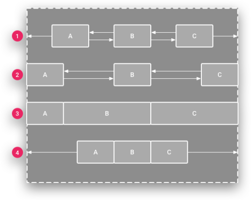

# Các kiểu layout hay dùng trong Android Studio và các sử dụng ViewBinding
## 1. Các layout hay dùng trong Android Studio
### 1.1 FrameLayout
- FrameLayout được sử dụng để chứa các khung hình con ở trong FrameLayout
- Ta có thể kiểm soát vị trí của các khung hình con vằng thuộc tính `gravity` với cú pháp là `android: layout_gravity`
* Hiển thị các khung hình con:
    - Các khung hình con được vẽ theo kiểu stack, là khung hình ở dưới sẽ nằm trên cùng
    - Kích thước của FrameLayout là kích thước của khung hình con lớn nhất + padding(nếu có)
    - Các khung hình con có trạng thái View.GONE chỉ được sử dụng để xác định kích thước nếu    `setConsiderGoneChildrenWhenMeasuring()` được đặt thành true.
        -Giải thích: Trong Android `View` có 3 trạng thái hiển thị là `View.Visible`: View hiển thị và chiếm không gian trong Layout, `View.INVISIBLE`: View không hiển thị nhưng vẫn chiếm không gian trong bố cục, `View.GONE`: View không hiển thị và không chiến không gian trong bố cục
        - `setConsiderGoneChildrenWhenMeasuring(true)`: set 1 cái khung hình con ở trạng thái `View.GONE` khi mà đo đạc. Ví dụ: Khi có 1 `TextView` có width và height nhưng visibility = "gone" (Trạng thái View.GONE) trong 1 FrameLayout. Nếu không set = true thì FrameLayout không cao như width và height theo lưu ý 2
- FrameLayout extends từ lớp `ViewGroup`
- Một vài lớp con kế thừa từ `FrameLayout`: ScrollView, HorizontalScrollView, TimePicker, ....
* Một số thuộc tính XML quan trọng của FrameLayout
    - `forground`: tạo 1 lớp phủ nằm trên nọi dung của View, nhưng vẫn dưới các view con của layout cha
    - Một vài giá trị hằng số: bottom, center, left, right, top, fill: foreground lấp đầy kích thước của FrameLayout, clip_horizontal: giới hạn chiều ngang của foreground không vượt View, clip_vertical: giới hạn chiều dọc của foreground không vượt View
    - `android:measureAllChildren`: Xác định xem có đo tất cả các khung nhìn con hay chỉ những khung nhìn ở trạng thái VISIBLE hoặc INVISIBLE khi đo lường. Mặc định là false

* Các thuộc tính chung :
    -  `android:addStatesFromChildren`: true/false view cha kế thừa trạng thái từ view con, `android:clipChildren`: true/ false ViewGroup không hiển thị phần view con nằm ngoài giới hạn của nó, `android:clipToPadding`: true/false ND con không được phép vẽ lên phần padding của ViewGroup.
    - `android:alpha`: Độ trong suốt, `android:background`, `android:clickable`: cho phép click , `android:contentDescription`: Mô tả ngữ nghĩa cho View, dùng cho trợ năng, `android:elevation`:  Độ cao ảo của View (ảnh hưởng đến bóng đổ), `android:focusable`: Cho phép View có thể được focus (lấy tiêu điểm), ví dụ khi dùng bàn phím hoặc điều khiển từ xa., `android:id`, `android:visibility`


### 1.2 RelaviteLayout
- RelativeLayout là một loại Layout mà trong đó, vị trí của các khung nhìn con (children) có thể được mô tả dựa trên mối quan hệ với nhau hoặc với chính Layout cha
* Các thuộc tính XML riêng của RelativeLayout:
    - `android:gravity`: Chỉ định cách một đối tượng nên định vị nội dung của nó, trên cả trục X và Y, trong giới hạn của chính nó.
    - Có thể là một hoặc nhiều giá trị hằng số như bottom, center, center_horizontal, center_vertical, clip_horizontal, clip_vertical, end, fill, fill_horizontal, fill_vertical, left, right, start, top.
    - `android:ignoreGravity`: Chỉ ra khung nhìn nào không nên bị ảnh hưởng bởi gravity

* Các vị trí của con với RelativeLayout cha:
    - ALIGN_PARENT_BOTTOM: Căn cạnh dưới của View con với cạnh dưới của RelativeLayout cha.
    - ALIGN_PARENT_TOP: Căn cạnh trên của View con với cạnh trên của cha.
    - ALIGN_PARENT_LEFT: Căn cạnh trái của View con với cạnh trái của cha.
    - ALIGN_PARENT_RIGHT: Căn cạnh phải của View con với cạnh phải của cha.
    - ALIGN_PARENT_START: Căn cạnh bắt đầu (start) của View con với cạnh start của cha (hỗ trợ RTL).
    - ALIGN_PARENT_END: Căn cạnh kết thúc (end) của View con với cạnh end của cha (hỗ trợ RTL).
    - CENTER_IN_PARENT: Căn giữa cả theo chiều ngang và dọc trong RelativeLayout cha.
    - CENTER_HORIZONTAL: Căn giữa theo chiều ngang trong cha.
    - CENTER_VERTICAL: Căn giữa theo chiều dọc trong cha.

* Các vị trí của con bằng liên hệ với nhau:
    - ABOVE: Căn cạnh dưới của View này nằm trên cạnh trên của View khác.
    - BELOW: Căn cạnh trên của View này nằm dưới cạnh dưới của View khác.
    - ALIGN_BASELINE: Căn đường cơ sở (baseline) của View này với View khác (thường dùng với TextView).
    - ALIGN_TOP: Căn cạnh trên của View này với View khác.
    - ALIGN_BOTTOM: Căn cạnh dưới của View này với View khác.
    - ALIGN_LEFT: Căn cạnh trái của View này với View khác.
    - ALIGN_RIGHT :Căn cạnh phải của View này với View khác.
    - ALIGN_START: Căn cạnh bắt đầu (start) của View này với View khác.
    - ALIGN_END: Căn cạnh kết thúc (end) của View này với View khác.
    - LEFT_OF: View này nằm bên trái View khác (cạnh phải View này trùng cạnh trái View kia).
    - RIGHT_OF : View này nằm bên phải View khác (cạnh trái View này trùng cạnh phải View kia).
    - START_OF: View này nằm trước (start) View khác.
    - END_OF: View này nằm sau (end) View khác.

### 1.3 Constraint Layout
- ConstraintLayout là một layout mạnh, nó giúp tạo ra các giao diện phức tạp, mềm dẻo (hạn chế tối đa sử dụng các layout lồng nhau). Nó giúp định vị, sắp xếp các View con dựa trên sự ràng buộc liên hệ của các View con với View cha và sự liên hệ ràng buộc giữa các View con với nhau, với cơ chế tạo xích các View, gán trọng số hay sử dụng trợ giúp giao diện với Guideline.
- Các loại ràng buộc (constraints) có thể sử dụng trong ConstraintLayout: ConstraintLayout hiện hỗ trợ nhiều loại ràng buộc khác nhau:
    - Định vị tương đối (Relative positioning)
    - Canh lề (Margins)
    - Định vị căn giữa (Centering positioning)
    - Định vị tròn (Circular positioning)
    - Hành vi hiển thị (Visibility behavior)
    - Ràng buộc kích thước (Dimension constraints)
    - Chuỗi (Chains)
    - Các đối tượng hỗ trợ ảo (Virtual Helpers objects)
    - Trình tối ưu hóa (Optimizer)

* Định vị tương đối:
    - Đây là một trong những khối xây dựng cơ bản để tạo bố cục trong ConstraintLayout.
    - Bạn có thể ràng buộc một widget trên trục ngang và dọc:
        - Trục ngang: cạnh trái, phải, bắt đầu (start) và kết thúc (end).
        - Trục dọc: cạnh trên, dưới và đường cơ sở văn bản (baseline).
    - Ví dụ: Để định vị nút B ở bên phải nút A, bạn sử dụng app:layout_constraintLeft_toRightOf="@+id/buttonA".
    - Các ràng buộc có sẵn:
        - layout_constraintLeft_toLeftOf
        - layout_constraintLeft_toRightOf
        - layout_constraintRight_toLeftOf
        - layout_constraintRight_toRightOf
        - layout_constraintTop_toTopOf
        - layout_constraintTop_toBottomOf
        - layout_constraintBottom_toTopOf
        - layout_constraintBottom_toBottomOf
        - layout_constraintBaseline_toBaselineOf
        - layout_constraintStart_toEndOf 
        - layout_constraintStart_toStartOf
        - layout_constraintEnd_toStartOf
        - layout_constraintEnd_toEndOf 

* Canh lề:
    - Các thuộc tính canh lề bố cục thông thường có thể được sử dụng:
        - android:layout_marginStart
        - android:layout_marginEnd
        - android:layout_marginLeft
        - android:layout_marginTop
        - android:layout_marginRight
        - android:layout_marginBottom
        - layout_marginBaseline

* Định vị căn giữa về độ lệch
- ConstraintLayout có cách xử lý đặc biệt với các ràng buộc "không thể" (ví dụ: một nút được ràng buộc đồng thời về bên trái và bên phải của parent).
    - Trong trường hợp này, các ràng buộc hoạt động như các lực đối nghịch kéo widget ra xa đều nhau, khiến widget được căn giữa trong container cha. Điều này cũng áp dụng tương tự cho các ràng buộc dọc.
    - Bias (Độ lệch): Mặc định là căn giữa, nhưng bạn có thể điều chỉnh vị trí để ưu tiên một bên hơn bên kia bằng cách sử dụng các thuộc tính bias:
        - layout_constraintHorizontal_bias
        - layout_constraintVertical_bias
    - Ví dụ, app:layout_constraintHorizontal_bias="0.3" sẽ làm cho cạnh trái có độ lệch 30% thay vì 50% mặc định, khiến widget nghiêng nhiều hơn về phía trái.

* Ràng buộc kích thước:
- Khi View con có thiết lập tối thiểu một kích thước là "0dp" thì kích thước đó có thể tự động điều chỉnh bằng cách lấy theo tỷ lệ với cạnh còn lại, thuộc tính app:layout_constraintDimensionRatio cho phép gán tỷ lệ giữa chiều rộng và chiều cao, ví dụ: app:layout_constraintDimensionRatio="2:1" chiều rộng gấp đôi chiều cao.

* Chain:
- Chains cho phép bạn điều khiển khoảng trống giữa các thành phần và cách mà các thành phần sử dụng khoảng trống đó. Để tạo chains , chọn thành phần mà bạn muốn là 1 thành phần của chains , sau đó chuột phải chon "Chains" để tạo theo chiều ngang hoặc chiều dọc
- Phần tử đầu của xích thiết lập kiểu xích bằng thuộc tính: `app:layout_constraintHorizontal_chainStyle` hoặc `app:layout_constraintVertical_chainStyle` tùy theo xích đứng hay ngang, mặc định xích có kiểu spread
- Bạn có thể chỉ định nhiều thể loại chain khác nhau. Các loại chain đó là.


1. Spread: Đây là kiểu dàn đều các view dựa vào không gian của chúng theo phương ngang hoặc dọc. Đây là kiểu sắp xếp mặc định khi bạn tạo mới một chain. Bạn có thể xem lại minh họa kiểu chain này ở trên kia.
2. Spread inside: Kiểu này cũng sẽ dàn đều các view, nhưng nó sẽ tôn trọng constraint của view đầu và cuối trong một chain. Như bạn thấy trên hình, nếu các view A và C đều set margin ở các biên là 0dp thì chúng sẽ dính chặt vào biên như vậy.
3. Weight: Cách này tương tự như bạn chỉ định trọng số layout_weight trong LinearLayout vậy. Để sử dụng được weight trong ConstraintLayout thì bạn phải chỉ định các view trong chain về match_constraint, rồi tìm đến thuộc tính horizontal_weight hoặc vertical_weight để thiết lập trọng số này cho từng view.
4. Packed: Kiểu “đóng gói” các view lại thành một “cục” sát vào nhau. Sau khi đóng gói các view lại xong, bạn có thể sử dụng bias để thay đổi độ lệch theo chiều ngang hoặc dọc cho các gói này (bạn nhớ để ý xem minh họa cho việc thay đổi bias với kiểu packed này ở dưới đây).

* Guideline:
- Nếu bạn có nhiều view được canh chỉnh theo một trật tự thẳng hàng nào đó (thẳng hàng ngang hay thẳng hàng dọc), bạn có thể cân nhắc sử dụng guideline. Ta có thể một đường kẻ ẩn trong ConstraintLayout nằm ngang hoặc đứng nó như là một View con để các View khác ràng buộc đến nếu muốn. Thêm vào bằng cách:
```xml
<androidx.constraintlayout.widget.ConstraintLayout xmlns:android="http://schemas.android.com/apk/res/android"
    xmlns:app="http://schemas.android.com/apk/res-auto"
    android:id="@+id/constraintLayout"
    android:layout_width="match_parent"
    android:layout_height="match_parent"
    android:padding="16dp">

    <!-- Guideline 30% -->
    <androidx.constraintlayout.widget.Guideline
        android:id="@+id/guideline_1"
        android:layout_width="wrap_content"
        android:layout_height="wrap_content"
        android:orientation="vertical"
        app:layout_constraintGuide_percent="0.3" />

    <!-- Guideline 60% -->
    <androidx.constraintlayout.widget.Guideline
        android:id="@+id/guideline_2"
        android:layout_width="wrap_content"
        android:layout_height="wrap_content"
        android:orientation="vertical"
        app:layout_constraintGuide_percent="0.6" />

    <!-- Button 1 -->
    <Button
        android:id="@+id/button1"
        android:layout_width="0dp"
        android:layout_height="wrap_content"
        android:text="Button 1"
        app:layout_constraintTop_toTopOf="parent"
        app:layout_constraintStart_toStartOf="parent"
        app:layout_constraintEnd_toStartOf="@+id/guideline_1"
        app:layout_constraintHorizontal_bias="1"
        android:layout_marginTop="100dp" />

    <!-- Button 2 -->
    <Button
        android:id="@+id/button2"
        android:layout_width="0dp"
        android:layout_height="wrap_content"
        android:text="Button 2"
        app:layout_constraintTop_toBottomOf="@+id/button1"
        app:layout_constraintStart_toStartOf="@id/guideline_1"
        app:layout_constraintEnd_toStartOf="@+id/guideline_2"
        android:layout_marginTop="32dp" />

    <!-- Button 3 -->
    <Button
        android:id="@+id/button3"
        android:layout_width="0dp"
        android:layout_height="wrap_content"
        android:text="Button 3"
        app:layout_constraintTop_toBottomOf="@+id/button2"
        app:layout_constraintStart_toStartOf="@id/guideline_2"
        app:layout_constraintEnd_toEndOf="parent"
        android:layout_marginTop="32dp" />

</androidx.constraintlayout.widget.ConstraintLayout>

    
```
- Thiết lập đó là được kẻ ngang bằng thuộc tính: android:orientation="horizontal" đường kể đứng android:orientation="vertical"

- Vị trị của Guideline có thể thiết lập nó cách cạnh trái (hoặc trên nếu là Guideline ngang) bằng thuộc tính app:layout_constraintGuide_percent giá trị là tỷ lệ phần trăm của ConstraintLayout.

* Bias

### 1.4 LinearLayout
- LinearLayout là một loại ViewGroup (nhóm chế độ xem) trong Android, cho phép bạn sắp xếp các chế độ xem con (widget) theo một chiều duy nhất: hoặc theo hàng ngang (horizontal) hoặc theo cột dọc (vertical)
* Sắp xếp các layout con:
    - LinearLayout là một ViewGroup có khả năng sắp xếp các layout con của nó.
    - CÓ thể chỉ định hướng sắp xếp bằng thuộc tính `android:orientation`:
        - "horizontal" để sắp xếp các chế độ xem con theo hàng ngang.
        -  "vertical" để sắp xếp các chế độ xem con theo cột dọc.
        -  Giá trị mặc định là "horizontal".
-  Căn chỉnh nội dung (Gravity):
    -  Thuộc tính `android:gravity` được sử dụng để kiểm soát cách LinearLayout căn chỉnh tất cả các chế độ xem mà nó chứa.
    - Giá trị của `android:gravity` ảnh hưởng đến cả căn chỉnh ngang và dọc của tất cả các chế độ xem con trong hàng hoặc cột.
    - Một số giá trị phổ biến của `android:gravity` bao gồm bottom, center, center_horizontal, center_vertical, left, right, start, end, top, fill, fill_horizontal, fill_vertical.
- Phân phối không gian (Weight):
    - Bạn có thể đặt thuộc tính `android:layout_weight` cho từng chế độ xem con để chỉ định cách LinearLayout phân chia không gian còn lại giữa chúng.
    - Thuộc tính `android:weightSum` được sử dụng để định nghĩa tổng trọng số tối đa. Nếu không được chỉ định, tổng trọng số sẽ được tính bằng cách cộng tất cả layout_weight của các chế độ xem con. Ví dụ, để một chế độ xem con chiếm 50% không gian, bạn có thể đặt layout_weight="0.5" và weightSum="1.0".

## 2. View Binding
- View Binding cung cấp cho ta có thể thay thế `findViewById` bằng các đối tượng ràng buộc giúp tăng hiệu suất hơn so với `findViewById`
* Setup
- Để bật view binding trong một module, bạn cần đặt tùy chọn viewBinding trong tệp build.gradle cấp module thành true
```xml
android {
    ...
    buildFeatures {
        viewBinding = true
    }
}
```
* Cách sử dụng
- Khi View binding được bật, một lớp binding sẽ được tạo cho mỗi tệp layout XML trong module. Tên của lớp binding được tạo bằng cách chuyển đổi tên tệp XML sang định dạng Pascal case và thêm từ "Binding" vào cuối. Ví dụ, với tệp layout result_profile.xml, lớp binding được tạo sẽ là ResultProfileBinding.
- Lớp binding này chứa các tham chiếu trực tiếp đến tất cả các view có ID trong layout tương ứng. Các view không có ID sẽ không có tham chiếu trong lớp binding. Mỗi lớp binding cũng bao gồm một phương thức getRoot() để cung cấp tham chiếu trực tiếp đến view gốc của tệp layout.
- Ví dụ về layout result_profile.xml:
```xml
<LinearLayout ... >
    <TextView android:id="@+id/name" />
    <ImageView android:cropToPadding="true" />
    <Button android:id="@+id/button" android:background="@drawable/rounded_button" />
</LinearLayout>
```
* Sử dụng View Binding trong Activity:
```kotlin
class MainActivity : AppCompatActivity() {

    // Khai báo biến binding
    private lateinit var binding: ActivityMainBinding

    override fun onCreate(savedInstanceState: Bundle?) {
        super.onCreate(savedInstanceState)

        // Khởi tạo binding bằng cách inflate layout
        binding = ActivityMainBinding.inflate(layoutInflater)

        // Gán root view cho setContentView
        setContentView(binding.root)

        // Sử dụng view thông qua binding
        binding.button.setOnClickListener {
            binding.name.text = "Xin chào View Binding!"
        }
    }
}

```
* Sử dụng View Binding trong Fragment:
```kotlin
class ProfileFragment : Fragment() {

    // Biến binding (nullable vì fragment có vòng đời phức tạp)
    private var _binding: FragmentProfileBinding? = null
    private val binding get() = _binding!!  // Chỉ dùng khi _binding != null

    override fun onCreateView(
        inflater: LayoutInflater, container: ViewGroup?,
        savedInstanceState: Bundle?
    ): View {
        // Inflate layout thông qua binding
        _binding = FragmentProfileBinding.inflate(inflater, container, false)
        return binding.root
    }

    override fun onViewCreated(view: View, savedInstanceState: Bundle?) {
        super.onViewCreated(view, savedInstanceState)

        // Sử dụng view qua binding
        binding.button.setOnClickListener {
            binding.name.text = "Hello từ Fragment!"
        }
    }

    override fun onDestroyView() {
        super.onDestroyView()
        // Giải phóng binding để tránh memory leak
        _binding = null
    }
}

```