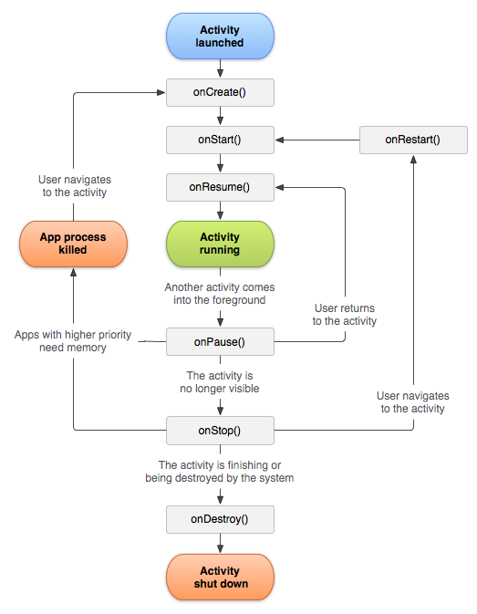
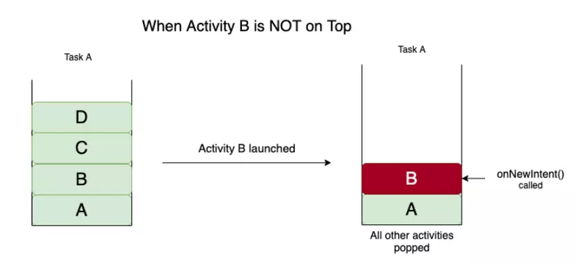

# Lí thuyết buổi 8
## 1. Foreground Application và Background Application là gì?
- Foreground application: là ứng dụng đang chạy, đang hiển thị cho người dùng thấy được. Ví dụ như người dùng đang dùng Facebook thì Facebook đang là foreground application
- Background application: là ứng dụng chạy ngầm bên trong hệ thống, thường khi người dùng tắt máy hoặc đang dùng 1 app khác mà app đó vẫn đc chạy. Ví dụ như các app nghe nhạc đều được chạy ngầm khi đang phát nhạc
## 2. Vòng đời của application
- Vòng đời app là một khái niệm quan trọng mà các developer android cần hiểu để mang lại trải nghiệm tốt cho người dùng
- Các khía cạnh chính của vòng đời ứng dụng Android:
    * Đa tác vụ trong Android:
        - Android là một hệ điều hành đa tác vụ cho phép nhiều tác vụ được chạy cùng 1 lúc. Nhưng trên thực tế, tại 1 thời điểm cụ thể nào đó, chỉ có 1 app được chạy (foreground) còn các app khác ở trạng thái nền (background)
        - Do không gian và tốc độ xử lý của thiết bị Android có hạn, Android đẩy các ứng dụng ít được sử dụng nhất vào bộ đệm để đảm bảo hoạt động trôi chảy và trải nghiệm người dùng tốt hơn. Khi một ứng dụng không được sử dụng trong thời gian dài, phương thức `onStop()` có thể được gọi để dừng hoạt động của nó
    * Độ ưu tiên của Ứng dụng Android Để quản lý bộ nhớ và pin hiệu quả, Android sẽ đẩy hoặc loại bỏ (kill) các ứng dụng có mức độ ưu tiên thấp hơn. Android gán mức độ ưu tiên cho các ứng dụng dựa trên trạng thái chạy hiện tại của chúng. Các trạng thái quy trình (ưu tiên từ cao đến thấp) bao gồm:
        - Foreground process (Quy trình tiền cảnh): Là quy trình mà người dùng đang tương tác trực tiếp. Ví dụ, khi bạn đang xem video trên YouTube, ứng dụng YouTube đang ở trạng thái Foreground và có mức độ ưu tiên cao nhất.
        - Visible process (Quy trình hiển thị): Hoạt động của ứng dụng có thể nhìn thấy nhưng không ở trạng thái Foreground. Ví dụ, khi Instagram yêu cầu quyền truy cập lưu trữ, hộp thoại quyền xuất hiện ở Foreground, nhưng hoạt động của Instagram vẫn hiển thị phía sau.
        - Service process (Quy trình dịch vụ): Là các quy trình đang chạy nhưng không thuộc hai loại trên. Chúng hữu ích cho các tác vụ nền như tải lên/tải xuống dữ liệu (ví dụ: tải tệp lên Google Drive).
        - Background process (Quy trình nền): Một quy trình ở trạng thái này khi phương thức onStop() được Android gọi. Ví dụ, khi bạn nhấn nút Home, ứng dụng đang chạy sẽ chuyển từ Foreground sang Background. Ứng dụng này sẽ được đặt vào bộ đệm LRU để dễ dàng tiếp tục khi người dùng mở lại, vì việc tiếp tục từ trạng thái trung gian dễ hơn là bắt đầu lại từ đầu.
        - Empty process (Quy trình trống): Là quy trình không có thành phần hoạt động nào của ứng dụng đang chạy. Mọi thành phần đều ở trạng thái dừng. Ứng dụng có thể được đưa vào LRU để lưu trữ tốt hơn, nhưng sẽ bị xóa khỏi bộ đệm khi bộ nhớ thiếu hoặc có dung lượng thấp.

## 3. Activity và Context
### 3.1 Activity
- Activity trong Android là một màn hình giao diện người dùng của ứng dụng Android. Một ứng dụng Android có thể chứa một hoặc nhiều Activity, nghĩa là một hoặc nhiều màn hình giao diện. Ứng dụng Android bắt đầu bằng cách hiển thị Activity chính (Main Activity) và có thể mở thêm nhiều màn hình Activity khác tuỳ theo chức năng của ứng dụng.
- Khai báo Activity trong AndroidManifest
    - Để một Activity có thể chạy được khi mở ứng dụng thì phải khai báo nó trong manifest
    - Mỗi Activity được khai báo với cú pháp:
    ```xml
    <activity
            android:name=".MainActivity"
            android:exported="true">
            <intent-filter>
                <action android:name="android.intent.action.MAIN" />

                <category android:name="android.intent.category.LAUNCHER" />
            </intent-filter>
    </activity>
    ```
    - Các thuộc tính thường gặp như `android:name` là tên Activity được khai báo, `android:exported` khai báo rằng activity nằng có thể được khởi động từ bên ngoài ứng dụng
    - `<intent-filter>`: Dùng để chỉ định các intent mà Activity có thể xử lý. Một intent-filter cho phép hệ thống biết khi nào nên khởi động Activity này.
    - `<action android:name="android.intent.action.MAIN" />`
    Khai báo rằng Activity này là entry point chính của ứng dụng, tức là điểm bắt đầu khi ứng dụng được khởi chạy.
    - `<category android:name="android.intent.category.LAUNCHER" />`
    Khai báo rằng Activity này nên được hiển thị trong launcher (màn hình chính của điện thoại) như một ứng dụng mà người dùng có thể nhấn để mở.

### 3.2 Context
- Context trong Android là bối cảnh của nơi mà chúng ta đang hiện diện và tương tác.

- Một vài quan điểm về context:
    - Nó là bối cảnh hiện tại của ứng dụng.
    - Nó có thể được sử dụng để lấy thông tin liên quan đến activity và ứng dụng.
    - Nó có thể được sử dụng để truy cập vào các tài nguyên, cơ sở dữ liệu của ứng dụng, v.v.
    - Cả Activity và Application đều được kế thừa từ Context class.
    - Context được sử dụng hầu như ở khắp mọi nơi trong phát triển ứng dụng Android và đó là điều quan trọng nhất trong phát triển các ứng dụng Android, vì vậy chúng ta phải hiểu để sử dụng nó một cách chính xác.
- Sử dụng sai ngữ cảnh có thể dẫn đến rò rỉ bộ nhớ (Memory leaks)trong một ứng dụng Android.
- Chủ yếu có 2 loại Context:
    * Application Context:
        - Nó là một thể hiện, là singleton và có thể được truy cập trong activity thông qua getApplicationContext().
        - Application Context được gắn với vòng đời của một ứng dụng.
        - Application context có thể được sử dụng khi bạn cần một context có vòng đời của nó tách biệt với context hiện tại hoặc khi bạn đang chuyển một context vượt ra ngoài phạm vi của activity.
        - Ví dụ: Nếu phải tạo một đối tượng singleton cho ứng dụng của mình và đối tượng đó cần một ngữ cảnh, hãy luôn sử dụng Application Context.
            - Nếu sử dụng Activity Context ở đây, nó sẽ dẫn đến rò rỉ bộ nhớ vì nó sẽ giữ tham chiếu đến activity và activity này sẽ không bị GC thu dọn.
            - Trong trường hợp, khi phải khởi tạo thư viện trong một activity, hãy sử dụng application context thay cho activity context.
        - Sử dụng getApplicationContext () khi cần một context cho một thứ có thể tồn tại lâu hơn bất kỳ context nào khác.
    * Acticity Context:
        - Mỗi activity sẽ có context của riêng nó. Contex tnày được gắn với vòng đời của activity.
        - Activity context nên được sử dụng khi bạn đang ở trong phạm vi của activity hoặc bạn cần context có vòng đời được gắn với ngữ cảnh hiện tại.
        - Ví dụ: Nếu phải tạo một đối tượng có vòng đời được gắn với một activity, có thể sử dụng activity context.
        - Khi đang ở trong 1 Activity, context gần nhất là Activity context. → Lấy bằng phương thức getContext () trong ContentProvider.

## 4. Vòng đời của Activity
- Sơ đồ: 

- Mô tả sơ đồ:
    1. Bắt đầu từ Activity Laucher, là activity được kích hoạt và đẩy vào backstack
    2. Sau khi kích hoạt sẽ chạy các hàm call back lần lượt là:
        - onCreate(): Khởi tạo và nạp giao diện layout
        - onStart(): Gọi ngay trước khi Activity hiển thị lên màn hình
        - onResume(): Được gọi ngay khi Activity bắt đầu có thể tương tác với người dùng, và Activity nằm trên cùng trong danh sách các Activity của hệ thống. Khởi tạo các trường, đăng ký listener, gán với services
    3. Sau khi gọi đến các callback trên, thì Activity mới chính thức được xem là đang chạy (Activity running). Lúc này, nếu có bất kỳ Activity nào khác chiếm quyền hiển thị, thì Activity hiện tại sẽ rơi vào trạng thái onPause().
    4. Nếu sự hiển thị của Activity khác làm cho Activity mà chúng ta đang nói đến không còn nhìn thấy nữa thì onStop() sẽ được gọi ngay sau đó. Nếu Acvitity đã vào onPause() rồi, tức là đang bị Activity khác đè lên, mà người dùng sau đó quay về lại Activity cũ, thì onResume() được gọi. Còn nếu Activity đã vào onStop() rồi, mà người dùng quay về lại Activity cũ thì onRestart() được gọi.
    5. Trong cả hai trường hợp Activity rơi vào onPause() hoặc onStop(), nó sẽ rất dễ bị hệ thống thu hồi (tức là bị hủy) để giải phóng tài nguyên, khi này nếu quay lại Activity cũ, onCreate() sẽ được gọi chứ không phải onResume() hay onRestart().
    6. Và cuối cùng, nếu một Activity bị hủy một cách có chủ đích, chẳng hạn như người dùng nhấn nút Back ở System Bar, hay hàm finish() được gọi,… thì onDestroy() sẽ được kích hoạt và Activity kết thúc vòng đời của nó.
- Các trạng thái chính trong Activity Lifecycle

    - Active/Running: Khi activity ở foreground và đang tương tác trực tiếp với user.
    - Pause: Activity không thể tương tác nhưng vẫn được nhìn thấy (bị che khuất không toàn toàn bởi một Activity khác)
    - Stop/Hidden: Activity bị che khuất hoàn toàn bởi một Activity khác, vẫn có thể lưu trữ thông tin những sẽ bị ưu tiên xóa bỏ nếu hệ thống thiếu bộ nhớ
    - Destroy: Khi gọi tới hàm finish() hoặc bị hệ thống xóa bỏ

- Các hàm callback mà tác dụng


|Hàm|Tác dụng|
|---|--------|
|`onCreate()`|Gắn layout (setContentView), khởi tạo các biến, giao diện, dữ liệu, thiết lập các listener|
|`onStart()`|Được gọi khi Activity trở nên hiển thị với người dùng. Nhưng lúc này Activity chưa ở foreground (chưa thể tương tác hoàn toàn).|
|`onResume()`|Được gọi khi Activity bắt đầu tương tác với người dùng. Đây là trạng thái hoạt động (foreground). Dùng để: khôi phục dữ liệu, bắt đầu phát nhạc, camera, animation...|
|`onPause()`|Được gọi khi Activity không còn ở foreground, nhưng vẫn còn hiển thị (Kiểu thông báo fb, mess, ...). Dùng để: lưu dữ liệu tạm thời, tạm dừng animation, video, cảm biến...|
|`onRestart()`|Được gọi sau onStop() và trước onStart() nếu Activity được khởi động lại. Dùng để: làm mới lại UI nếu cần khi quay lại Activity.|
|`onDestroy()`|Được gọi trước khi Activity bị hủy hoàn toàn. Dùng để: giải phóng tất cả tài nguyên còn lại, ghi log, dọn dẹp bộ nhớ, hủy đăng ký listener|

## 5. Activity Backstack
- Trong hệ điều hành Android, một Task (tác vụ) là một tập hợp các Activity (màn hình ứng dụng) mà người dùng tương tác khi thực hiện một mục tiêu nhất định trong ứng dụng của bạn. Mỗi khi một ứng dụng được khởi chạy, hệ thống sẽ xem đó là một Task mới.
- Mỗi Task sẽ chứa thông tin về Back Stack của nó. Bạn có thể tưởng tượng Back Stack là một "ngăn đựng đồ" hoặc một "ngăn xếp". Khi một Activity được mở, nó sẽ được đặt vào ngăn xếp này
* Cơ chế hoạt động của Back Stack (LIFO)
Back Stack hoạt động theo nguyên tắc "Last In, First Out" (Vào Sau, Ra Trước - LIFO). Điều này có nghĩa là:
    - Activity được mở sau cùng sẽ nằm ở trên cùng của ngăn xếp.
    - Activity nằm trên cùng của ngăn xếp sẽ là Activity được hiển thị cho người dùng.
    - Khi một Activity bị loại bỏ khỏi ngăn xếp (ví dụ như khi nhấn nút Back), Activity ở trên cùng sẽ bị loại bỏ trước tiên, và Activity nằm ngay bên dưới nó sẽ được hiển thị

* Ví dụ về cách Back Stack hoạt động:
    1. Khởi chạy ứng dụng: Khi bạn chạm vào biểu tượng ứng dụng (ví dụ TourNote) trên màn hình chính, hệ thống sẽ tạo một Task mới cho ứng dụng đó. Activity được đánh dấu là "launcher" (ví dụ MainActivity) sẽ được thực thi và đặt vào Back Stack, nằm ở dưới cùng của ngăn xếp.
    2. Mở Activity mới: Từ MainActivity, khi bạn kích hoạt một Activity khác (ví dụ ContactActivity) bằng cách gọi startActivity(), ContactActivity sẽ được đẩy vào đỉnh của Back Stack. MainActivity lúc này vẫn còn trong Back Stack nhưng bị dừng lại và chuyển về chế độ nền, giữ nguyên trạng thái giao diện người dùng của nó. ContactActivity sẽ được hiển thị vì nó đang ở trên cùng của ngăn xếp.
    3. Nhấn nút Back:
        ◦ Khi bạn nhấn nút Back (trên ActionBar hoặc System Bar) từ ContactActivity, ContactActivity sẽ bị lấy ra khỏi Back Stack và chính thức bị hủy.
        ◦ Màn hình sẽ nhường chỗ cho Activity nằm ngay bên dưới nó trong Back Stack, chính là MainActivity. Trạng thái giao diện người dùng của MainActivity sẽ được khôi phục.
        ◦ Nếu bạn tiếp tục nhấn Back từ MainActivity, MainActivity cũng sẽ bị hủy.
        ◦ Khi tất cả các Activity đã bị xóa khỏi Back Stack, Task sẽ không còn tồn tại và ứng dụng sẽ bị đóng hoàn toàn (theo góc nhìn của người dùng)

* Các bản sao của Activity:
    - Back Stack cho phép đặt nhiều bản sao (copy) của cùng một Activity. Ví dụ, nếu từ ContactActivity bạn gọi startActivity() để quay lại MainActivity thay vì finish(), một bản sao mới của MainActivity sẽ được đẩy vào Back Stack.

## 6. Intent
### 6.1 Khái niệm:
- Intent là một thành phần quan trọng trong android, cho phép các thành phần ứng dụng có thể yêu cầu các hàm từ các thành phần ứng dụng khác. Ví dụ như một activity có thể chạy 1 activity khác
- Các cách sử dụng chính với Intent
    - `startActivity()` đề khởi chạy một activity
    - `broadcastIntent()` để gửi broadcast đến bất kì thành phần `BroadcastReceiver` nào quan tâm
    - `Context.startService(Intent)` hoặc `Context.bindService(Intent, BindServiceFlags, Executor, ServiceConnection)` để giao tiếp với một Service ẩn
    - Ví dụ:
    ```kotlin
    val intent = Intent(this, OtherActivity::class.java)
    startActivity(intent) //Khởi chạy một Activity

    Intent intent = new Intent("com.example.MY_CUSTOM_ACTION")
    intent.putExtra("data", "Hello Receiver!")
    sendBroadcast(intent) // Gửi một Broadcast

    public class MyReceiver extends BroadcastReceiver {
    @Override
        public void onReceive(Context context, Intent intent) {
            String data = intent.getStringExtra("data")
            Log.d("Receiver", "Received: " + data) //Nhận một broadcast
        }
    }
    ```
- Phân loại:
    - Explicit Intent - Intent tường minh:
        - Intent tường minh tức là khi tạo một đối tượng Intent, chúng ta chỉ định rõ và truyền trực tiếp tên thành phần đích vào intent.
        - Ví dụ: như đoạn code bên dưới, intent được chỉ định rõ OtherActivity sẽ là thành phần nhận và xử lý intent này.
        ```kotlin
        val intent = Intent(this, OtherActivity::class.java)
        startActivity(intent) //Khởi chạy một Activity
        ```
    - Implicit Intent - Intent không tường minh
        - Thay vì trong intent Android được chỉ định sẵn một Activity nào đó thực hiện, thì sẽ chỉ truyền vào action và gửi cho Android. Android sẽ dựa vào action đó mà lọc những thành phần nào đã đăng kí action đó gọi ra.
        - Vì vậy, Android có thể tự động kích hoạt thành phần từ cùng một ứng dụng hoặc một số ứng dụng khác để xử lý intent đó.

        - Ví dụ, chúng ta cần phải hiển thị một vị trí lên bản đồ. Thay vì chúng ta phải mã hóa và viết hẳn module bản đồ để hiển thị thì có thể gửi vị trí đó vào intent, rồi Android sẽ tự tìm xem có ứng dụng nào phù hợp( như Google Map chẳng hạn) để hiển thị nó.

        - Thông thường, chúng ta dùng các intent tường minh để kích hoạt các thành phần trong ứng dụng, còn intent không tường minh để chạy các thành phần của ứng dụng bên thứ 3.

        - Đây là một đoạn code minh họa cho intent không tường minh(setData cho Intent bằng 1 url ở phần mềm thứ 3 rồi startActivity() cho nó)

        ```kotlin
        Intent intent=new Intent(Intent.ACTION_VIEW);
        intent.setData(Uri.parse("http://www.tutlane.com"));
        startActivity(intent);
        ```
## 7. Launch Mode
- LaunchMode trong Android là một mô tả cho hệ điều hành Android cách mà các Activity trong một ứng dụng Android sẽ được khởi tạo trong một task của chương trình.
- Có 4 loại launchMode trong Android là:
    - standard
    - singleTop
    - singleTask
    - singleInstance
- Để khai báo launchMode cho 1 activity, ta cần thêm thuộc tính launchMode trong file AndroidManifest.xml
```xml
<activity
    android:name = ".MainActivity"
    android:launchMode = "singleTop" />
```
### 7.1 Standard launchMode
- Standard là chế độ mặc định của 1 Activity, nếu như khi khởi tạo activity trong file AndroidManifest.xml bạn không khai báo gì thì mặc định Activity sẽ ở chế độ này.
- Một Activity ở Standard launchMode sẽ luôn luôn khởi tạo nên 1 instance mới trong Task khi nó được gọi đến bởi Intent dù là Activity ấy đã tồn tại trước đó trong Task

- Thực chất của Standard launchMode là việc các Instance của Activity sẽ liên tiếp xếp chồng nên nhau trong 1 task mỗi khi nó được start với intent
### 7.2 singleTop launchMode
- singleTop launchMode cũng có cơ chế tương tự như Standard khi nó có thể tạo ra nhiều Instance của một Activity trong cùng 1 task.Tuy nhiên có một điều khác biệt căn bản đó là chỉ có duy nhất 1 instance của một Activity được phép tồn tại trên top(hay root) của một task. Khi start 1 activity nếu nó đã có instance ở top của task đó thì thay vì tạo instance mới và chồng nên Activity hiện tại thì hàm onNewIntent() sẽ được gọi ra để khởi chạy Activity đó.

- Trường hợp nếu activity được gọi đến đang không nằm ở top của task hiện tại thì một instance của activity đó sẽ được tạo ra và nằm trên top của task hiện tại.
### 7.3 singleTask launchMode
- Ở mode này Activity sẽ chỉ có duy nhất 1 instance trong 1 task. Trong trường hợp khởi tạo activity này nếu nó đang nằm trong top của Task thì hàm onNewIntent() sẽ được gọi. Ngược lại thì chương trình sẽ pop tất cả các Activity phía trên của Activity đó trong task sau đó gọi đến hàm onNewIntent().


- Trong trường hợp activity đó chưa có trong task thì 1 instance mới của nó sẽ được tạo ra.
### 7.4 singleInstance launchMode
- singleTask và singleInstance đều giống nhau ở điểm chỉ có duy nhất 1 instance của 1 Activity được phép tồn tại trong 1 Task. Điều khác biệt duy nhất đó là sử dụng singleInstance thì mỗi khi Activity khi được gọi đến thì chương trình sẽ tạo ra 1 Task riêng biệt để chứa nó. Tức là 1 task chỉ chứa duy nhất 1 activity.


## 8. Các cờ khi chuyển hướng màn hình
- FLAG_ACTIVITY_NEW_TASK: Khởi động Activity trong một Task mới.
- FLAG_ACTIVITY_CLEAR_TOP: Nếu Activity đang được khởi động đã chạy trong Task hiện tại, tất cả các Activity khác trên đỉnh của nó sẽ bị hủy.
- FLAG_ACTIVITY_SINGLE_TOP: Nếu Activity đang được khởi động là Activity hiện tại và ở trên cùng của Back Stack, instance hiện có sẽ nhận được lệnh mới thay vì tạo một instance mới.
- FLAG_ACTIVITY_CLEAR_TASK: Khi start một Activity với flag này thì cho dù điều kiện nào, hệ thống cũng sẽ tạo Instance mới và đồng thời destroy hết toàn bộ Activity có trong stack.

- Ví dụ về lauchMode và các Flag khi chuyển hướng
```xml
<manifest xmlns:android="http://schemas.android.com/apk/res/android">

    <application
        android:allowBackup="true"
        android:label="LaunchModeTest"
        android:theme="@style/Theme.AppCompat.Light.DarkActionBar">

        <activity android:name=".MainActivity"
            android:exported="true">
            <intent-filter>
                <action android:name="android.intent.action.MAIN" />
                <category android:name="android.intent.category.LAUNCHER" />
            </intent-filter>
        </activity>

        <!-- SingleTop demo -->
        <activity android:name=".SecondActivity"
            android:launchMode="singleTop" />

        <!-- ThirdActivity không có launchMode, dùng mặc định -->
        <activity android:name=".ThirdActivity" />

    </application>

</manifest>

```
```kotlin
package com.example.launchmodetest

import android.R
import android.content.Intent
import android.os.Bundle
import android.view.View
import androidx.appcompat.app.AppCompatActivity

class MainActivity : AppCompatActivity() {
    override fun onCreate(savedInstanceState: Bundle?) {
        super.onCreate(savedInstanceState)
        setContentView(R.layout.activity_main)

        // Chuyển đến SecondActivity
        findViewById<View?>(R.id.btnToSecond).setOnClickListener(View.OnClickListener { v: View? ->
            val intent = Intent(this@MainActivity, SecondActivity::class.java)
            startActivity(intent)
        })

        // Chuyển đến ThirdActivity
        findViewById<View?>(R.id.btnToThird).setOnClickListener(View.OnClickListener { v: View? ->
            val intent = Intent(this@MainActivity, ThirdActivity::class.java)
            startActivity(intent)
        })
    }
}
```

Output:
- Nhấn "Go to SecondActivity" 2 lần	: Lần 2 sẽ gọi onNewIntent() nếu dùng FLAG_ACTIVITY_SINGLE_TOP
- Từ ThirdActivity, nhấn "Back to SecondActivity": Xoá Third khỏi stack
- Nhấn "Logout": Quay về MainActivity, xóa hết các Activity trước đó

## 9. Truyền dữ liệu giữa 2 Activity
- Chúng ta chỉ có duy nhất một cách để truyền dữ liệu qua lại giữa các Activity. Đó là cách “nhét” dữ liệu vào Intent và nhờ thành phần này chuyển giúp. Hệ thống sẽ đảm bảo dữ liệu được gửi qua “nguyên vẹn” và kịp thời ở Activity mới.
## 9.1 Extra
- Truyền dữ liệu bằng Extra là dễ nhất và cú pháp cũng đơn giản
* Gửi dữ liệu:
    - Để gửi dữ liệu bằng Extra, ta cần khai báo 1 Intent nào đó, gửi nó đến Activity nào. Sau đó là sử dụng các phương thức được định nghĩa sẵn để gửi dữ liệu. Các phương thức này có chung 1 tên là `putExtra()`
    
    ```kotlin
    Intent intent = new Intent(this, ContactActivity.class);
    intent.putExtra("Key_1", "Truyền một String");  // Truyền một String
    intent.putExtra("Key_2", 5);                    // Truyền một Int
    intent.putExtra("Key_3", true);                 // Truyền một Boolean
    startActivity(intent);`
    ```
* Nhận dữ liệu:
- Lúc này, ở file activity được gửi dữ liệu sang, ta có thể gọi đến phương thức `get..Extra()` ở trong `onCreate()` hoặc bất kì chỗ nào để lấy cặp key/value đó

- Một số phương thức cần phải có tham số thứ hai, tham số này chính là dữ liệu mặc định nếu như hệ thống không tìm thấy dữ liệu với key cung cấp. Việc cung cấp tham số thứ hai này tránh một số lỗi xảy ra đối với chương trình.

- Đoạn code sau minh họa cách lấy dữ liệu ra khỏi Intent bằng Extra ở onCreate() của Activity.
```kotlin
@Override
protected void onCreate(Bundle savedInstanceState) {
  super.onCreate(savedInstanceState);
  setContentView(R.layout.activity_contact);

  Intent intent = getIntent();
  String value1 = intent.getStringExtra("Key_1");
  int value2 = intent.getIntExtra("Key_2", 0);
  boolean value3 = intent.getBooleanExtra("Key_3", false);
}
```

## 9.2 Bundle
- Thực ra Bundle và Extra không khác gì nhau hết. Nếu như Extra sẽ “xé lẻ” dữ liệu ra và gửi theo từng dòng. Thì Bundle sẽ giúp “đóng gói” dữ liệu lại và gửi nguyên kiện. Bundle sẽ tiện hơn trong trường hợp muốn gửi cùng một bộ dữ liệu đến nhiều Activity khác nhau.
* Gửi dữ liệu bằng Bundle
    - Đầu tiên là dòng tạo ra Bundle, sau đó vẫn là các dòng đặt dữ liệu vào Bundle, các dòng này có hơi khác với các dòng đặt dữ liệu vào Extra một chút, nếu với Extra dùng các phương thức nạp chồng với cùng một tên putExtra() thì với Bundle phải dùng đúng phương thức put...() với Xxx là kiểu dữ liệu cần dùng.

    

    - Khi Bundle đã chứa đủ dữ liệu, cần phải đặt Bundle này vào trong Intent bằng một dòng code putExtras()

    ```kotlin
    Intent intent = new Intent(this, ContactActivity.class);
    Bundle bundle = new Bundle();
    bundle.putString("Key_1", "Truyền một String"); // Truyền một String
    bundle.putInt("Key_2", 5);                      // Truyền một Int
    bundle.putBoolean("Key_3", true);               // Truyền một Boolean
    intent.putExtras(bundle);
    startActivity(intent);
    ```
* Nhận dữ liệu bằng Bundle
    - Bên nhận cũng sẽ nên nhận theo Bundle trước rồi mới lấy từng dữ liệu ra dùng. Để lấy Bundle ra khỏi Intent thì chúng ta có phương thức getExtras().

    - Sau khi lấy Bundle ra khỏi Intent, việc tiếp theo sẽ gọi đến các phương thức getXxx() của nó. Các phương thức này của Bundle cũng giống như các phương thức getXxxExtra() của Extra trên kia. Chỉ khác một chỗ get...() của Bundle thường có hai phương thức nạp chồng, linh động hơn. Thường thì nên dùng get...() với hai tham số, như vậy có thể định nghĩa được giá trị mặc định cho từng phương thức khi mà nó không tìm thấy dữ liệu từ key cung cấp, giúp tránh một số lỗi không cần thiết.

    

    - Để chắc chắn thì khi nhận dữ liệu với Bundle, nên kiểm tra xem Bundle đó có tồn tại hay không (kiểm tra khác null) trước.

    ```kotlin
    @Override
    protected void onCreate(Bundle savedInstanceState) {
    super.onCreate(savedInstanceState);
    setContentView(R.layout.activity_contact);


    Intent intent = getIntent();
    Bundle bundle = intent.getExtras();
    if (bundle != null) {
        String value1 = bundle.getString("Key_1", "");
        int value2 = bundle.getInt("Key_2", 0);
        boolean value3 = bundle.getBoolean("Key_3", false);
    }
    }
    ```

## 10. Multi-resume, onTopResumedActivityChanged()
- Multi-resume là một tính năng được giới thiệu trong Android 10. Nó thay đổi cách các hoạt động (activities của ứng dụng được quản lý trạng thái, đặc biệt trong các chế độ hiển thị nhiều cửa sổ hoặc màn hình).
- Trong Android 10:
    -  Tất cả hoạt động có thể lấy tiêu điểm ở trên cùng trong ngăn xếp hiển thị đều ở trạng thái RESUMED (được tiếp tục).
    - Điều này giúp cải thiện khả năng tương thích với chế độ Nhiều cửa sổ (Multi-window) và chế độ MD (Multi-display) cho các ứng dụng sử dụng onPause() thay vì onStop() để ngừng làm mới giao diện người dùng và tương tác với người dùng.
    - Cụ thể, trong Android 10:
        - Cả hai hoạt động ở chế độ chia đôi màn hình đều được tiếp tục.
        - Tất cả hoạt động hiển thị trên cùng ở chế độ cửa sổ hình dạng tùy ý sẽ được tiếp tục.
        - Bạn có thể tiếp tục các hoạt động trên nhiều màn hình cùng một lúc.
    - Trạng thái vòng đời hoạt động được xác định bằng chế độ hiển thị và thứ tự Z.
    - Multi-resume được biểu diễn qua Hình 1 (trên thiết bị có thể gập lại) và Hình 2 (ở chế độ máy tính).
    
    
- Xử lý dữ liệu đầu vào của người dùng:
    - Phương pháp multi-resume cho các ứng dụng biết rằng một hoạt động chỉ có thể nhận dữ liệu đầu vào từ người dùng ở trạng thái RESUMED.
    - Trước Android 10, các hoạt động cũng có thể nhận dữ liệu đầu vào ở trạng thái PAUSED (ví dụ: chạm vào cả hai hoạt động ở chế độ chia đôi màn hình trên thiết bị Android 9).
- Lệnh gọi lại mới: `Activity#onTopResumedActivityChanged(boolean onTop)`
Để duy trì tín hiệu "tiếp tục" từ các bản phát hành Android trước và để thông báo khi ứng dụng nên có quyền truy cập vào tài nguyên độc quyền hoặc singleton, Android 10 bao gồm một lệnh gọi lại mới là Activity#onTopResumedActivityChanged(boolean onTop).
    - Lệnh gọi lại này được gọi giữa `Activity#onResume()` và `Activity#onPause()`.
    - Nó là không bắt buộc và có thể bỏ qua; một hoạt động có thể chuyển từ RESUMED sang PAUSED mà không trở thành hoạt động trên cùng trong hệ thống (ví dụ: ở chế độ nhiều cửa sổ).
    - Vì không bắt buộc, nó không thuộc Vòng đời hoạt động và hiếm khi được sử dụng.
    - Hoạt động tiếp tục hàng đầu trước đó sẽ nhận và hoàn tất quá trình thực thi `onTopResumedActivity(false)` trước khi hoạt động tiếp tục hàng đầu tiếp theo nhận được `onTopResumedActivity(true)`, trừ khi hoạt động trước đó mất quá nhiều thời gian và hết thời gian chờ 500 mili giây.