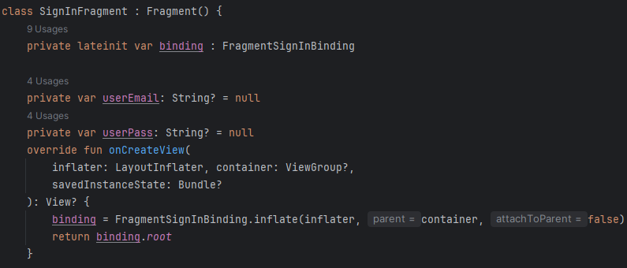
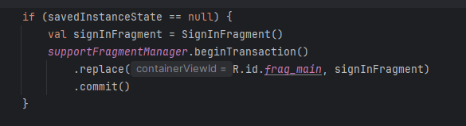
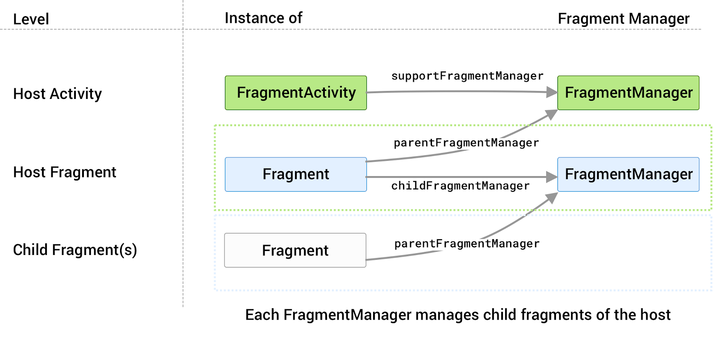
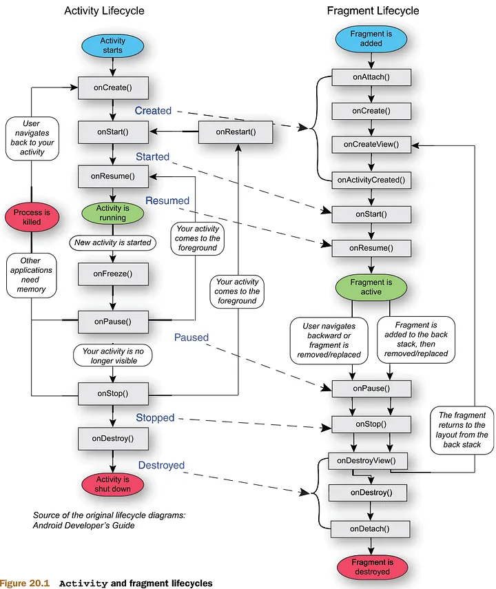
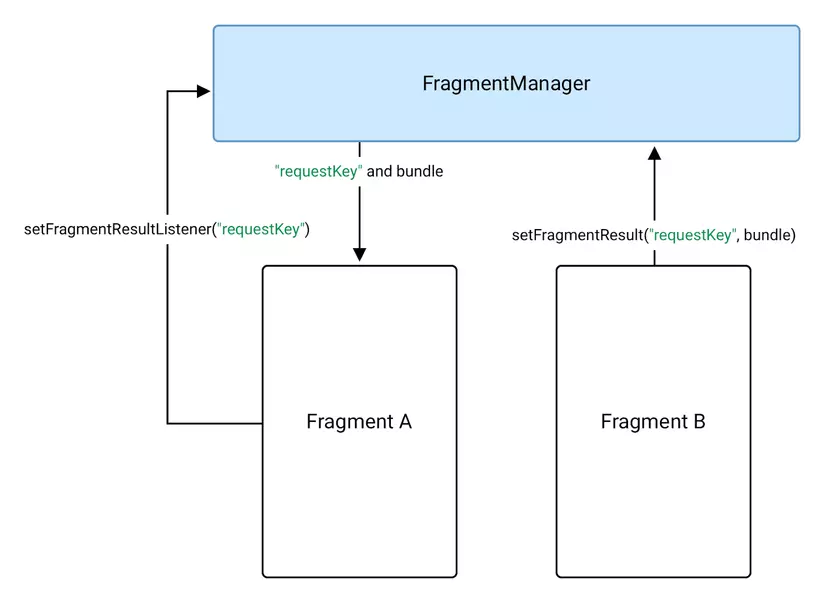
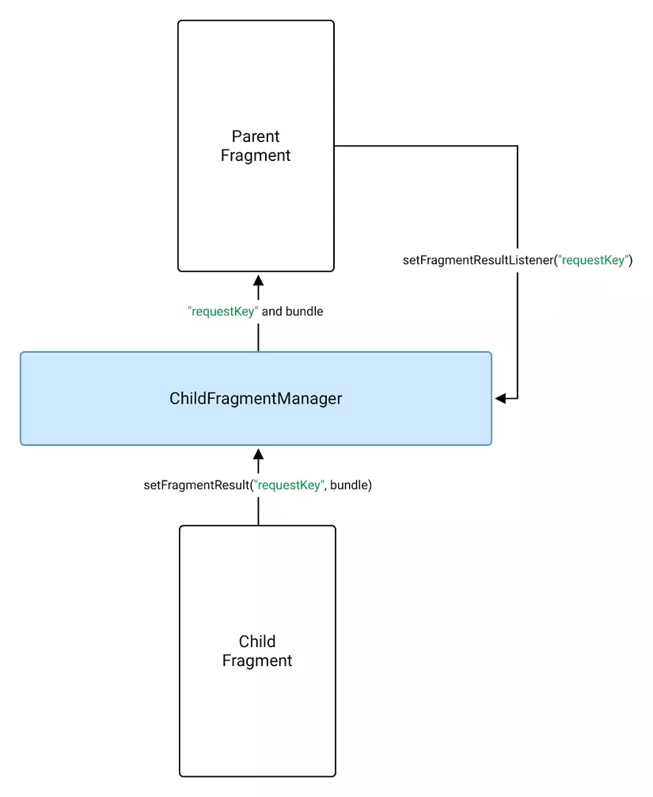

# Fragment
## 1. Tìm hiểu về Fragment, FragmentMânger, FragmentTransaction
### 1.1 Fragment là gì.
- Trong android, tại một thời điểm, chỉ có một Activity được hiển thị duy nhất trên màn hình. Chúng ta muốn chia màn hình ra nhiều phần để sử dụng thì fragment đáp ứng điều đó
- Fragment là một thành phần android độc lập, được sử dụng bởi một activity, giống như một sub-activity. Fragment có vòng đời và UI riêng. Các Fragment thường có một file java/kotlin đi kèm với giao diện xml. Các fragment không có file giao diện xml thường được gọi là headless fragment.
- Fragment sử dụng method getActivity() để lấy ra Activity bố
- Fragment được định nghĩa trong file xml của activity (static definition) hoặc có thể sửa đổi fragment khi đang chạy (dynamic definition)


* Cách tạo ra một file fragment để sử dụng:
- B1: Thiết lập build.gradle của Fragment:
```xml
dependencies {
    val fragment_version = "1.8.8"

    // Java language implementation
    implementation("androidx.fragment:fragment:$fragment_version")
    // Kotlin
    implementation("androidx.fragment:fragment-ktx:$fragment_version")
}
```
- B2: tạo một package fragment, trong đó có chứa các Fragment để xử lí logic của các Fragment layout



- B3: tạo file xml để set layout cho một fragment
```xml
<?xml version="1.0" encoding="utf-8"?>
<FrameLayout xmlns:android="http://schemas.android.com/apk/res/android"
    android:layout_width="match_parent"
    android:layout_height="match_parent">

    <TextView
        android:id="@+id/txt_example"
        android:layout_width="wrap_content"
        android:layout_height="wrap_content"
        android:text="Đây là Example Fragment"
        android:layout_gravity="center" />

</FrameLayout>
```
- B4: gắn Fragment vào Activity

- Giải thích cở bản:
    - `saveInstanceState == null`: Đảm bảo fragment chỉ được thêm một lần, khi hoạt động được tạo lần đầu. Khi có thay đổi và hoạt động được tạo lại, `saveInstanceState` sẽ không còn null, và fragment không cần được thêm lần thứ 2
    - `supportFragmentManager`: là đối tượng quản lý các Fragment trong Activity. Dùng để thêm, thay thế, xóa, hoặc thao tác với các Fragment trong Activity.
    - `.beginTransaction()`: Bắt đầu 1 thay đổi với Fragment
    - `replace(a,b)`: thay thế nội dung trong a = b
    - `commit()`: áp dụng thay đổi 

* So sánh Fragment và Activity:

| Tiêu chí                    | Fragment                                                | Activity                                                   |
|----------------------------|----------------------------------------------------------|------------------------------------------------------------|
| **Khái niệm**              | Thành phần giao diện có thể tái sử dụng trong Activity  | Màn hình độc lập trong ứng dụng Android                   |
| **Vòng đời**               | Phụ thuộc vào Activity chứa nó                          | Quản lý riêng biệt bởi hệ thống Android                   |
| **Quản lý**                | Được quản lý bởi `FragmentManager`                      | Được quản lý bởi hệ điều hành Android                     |
| **Tái sử dụng**            | Dễ tái sử dụng trong nhiều Activity hoặc layout         | Khó tái sử dụng giữa các phần khác nhau                  |
| **Khả năng chứa**         | Cần được chứa trong một Activity                        | Có thể chứa nhiều Fragment                                 |
| **Khả năng hiển thị song song** | Có thể hiển thị nhiều Fragment trên cùng một màn hình | Mỗi Activity là một màn hình độc lập                     |
| **Hiệu năng**              | Nhẹ hơn, thường dùng cho UI đa phần                     | Nặng hơn do quản lý riêng toàn bộ vòng đời                |
| **Giao tiếp giữa các thành phần** | Phải giao tiếp thông qua Activity trung gian           | Giao tiếp trực tiếp giữa các Activity qua `Intent`        |
| **Khai báo trong Manifest**| Không cần                                                | Cần khai báo trong `AndroidManifest.xml`                  |
| **Chuyển đổi giữa các thành phần** | Dùng `FragmentTransaction`                              | Dùng `Intent` và `startActivity()`                        |

### 1.2 FragmentManager
- FragmentManager là một lớp chịu trách nhiệmh thực hiện các hành động trên các fragments của ứng dụng. Các hành động bao gồm thêm, xóa, thay thế fragment, thêm fragment vào backstack.

* Cách truy cập vào FragmentManager:
- Ta có thể truy cập `FragmentManager` từ một Activity hoặc một Fragment
- `FragmentActivity` và các lớp con của nó, chẳng hạn như `AppCompatActivity` có quyền truy cập vào `FragmentManager` thông qua phương thứ `getSupportFragmentManager()`
- Các fragment có thể lưu 1 hoặc nhiều các fragment con. Bên trong fragment, có thể lấy thông tin tham chiếu đến FragmentManager quản lý các mảnh con thông qua `getChildFragmentManager()`. Nếu cần truy cập vào `FragmentManager` của cha thì dùng `getParentFragmentManager()`
- Ví dụ:


- Ví dụ khi nhấn nút profile hiện ra, các nút có thể biến mất, back ground thay đổi thì mình sẽ gọi đến `getParentFragmentManager()` của những thằng cha để thay đổi

* Quản lí backstack bằng FragmentManager:
- FragmentManager quản lí backstack của fragment. Trong thời gian chạy, FragmentManager có thể thực hiện các thao tác backstack như thêm hoặc xóa các fragment để phản hồi tương tác của user.
- Khi người dùng nhấn nút back hoặc khi gọi đến `FragmentManager.popBackStack()`, fragment trên cùng sẽ pop ra khỏi stack
- Nếu backstack trống, khi người dùng nhấn nút back, hệ thống sẽ đón Activity chứa fragment đó
- Nếu bạn gọi .addToBackStack() sau khi thực hiện các thao tác này, thì tất cả sẽ được xem là một giao dịch.

- Khi back, tất cả các thao tác sẽ bị đảo ngược cùng lúc, như một khối nguyên tử.
```kotlin
supportFragmentManager.beginTransaction()
    .replace(R.id.container1, FragmentA())
    .replace(R.id.container2, FragmentB())
    .addToBackStack(null)
    .commit()

```
-> Khi nhấn "Back", cả FragmentA và FragmentB sẽ bị pop ra cùng lúc.

-  Khi ngăn xếp lui được đẩy, tất cả các thao tác này sẽ đảo ngược thành một hành động ở cấp nguyên tử.

### 1.3 FragmentTransaction
- Trong thời gian chạy, FragmentManager có thể thêm, xoá, thay thế và thực hiện các thao tác khác với các fragment (fragment) để phản hồi khi người dùng tương tác. Mỗi tập hợp thay đổi fragment mà bạn xác nhận (commit) được gọi là một giao dịch (transaction) và bạn có thể chỉ định việc cần làm bên trong giao dịch bằng cách sử dụng các API mà lớp FragmentTransaction cung cấp.

```kotlin
val fragmentManager = ...
val fragmentTransaction = fragmentManager.beginTransaction()
```
- Để hiển thị một fragment trong vùng chứa bố cục, sử dụng FragmentManager để tạo một FragmentTransaction. Sau đó, trong giao dịch, có thể thực hiện thao tác add() hoặc replace() trên vùng chứa.

```kotlin
supportFragmentManager.commit {
 replace<ExampleFragment>(R.id.fragment_container)
 setReorderingAllowed(true)
 addToBackStack("name") // Name can be null
}
```
- Lệnh gọi cuối cùng trên mỗi FragmentTransaction phải là commit() → Báo hiệu cho FragmentManager rằng tất cả thao tác (operation) đã được thêm vào giao dịch.

```kotlin
val fragmentManager = ...
// The fragment-ktx module provides a commit block that automatically
// calls beginTransaction and commit for you.
fragmentManager.commit {
  // Add operations here
}
FragmentTransaction fragmentTransaction = fragmentManager.beginTransaction();
fragmentTransaction.add(R.id.ui_container, new MyListFragment());
Fragment fragment = fragmentManager.findFragmentById(R.id.details_fragment);
fragmentTransaction.remove(fragment);
String tag = null;
fragmentTransaction.addToBackStack(tag);
fragmentTransaction.commit();
```

## 2. Fragment Lifecycle
- Mỗi phiên bản `Fragment` đều có vòng đời riêng. Khi một người dùng điều hướng và tương tác với ứng dụng, các fragment sẽ dịch chuyển qua các trạng thái khác nhau của vòng đời khi chúng được thêm, xóa, xuất hiện hoặc thoát khỏi màn hình.

- Để quản lý vòng đời, fragment thực hiện `LifecycleOwer`, hiển thị một đối tượng `Lifecycle` có thể được truy cập bằng phương thức `getLifecycle()`

- Mỗi trạng thái `Lifecycle` sẽ được biểu thị trong enum `Lifecycle.State.`

`INITIALIZED`
`CREATED`
`STARTED`
`RESUMED`
`DESTROYED`


- Các callback:
    - `onAttach()`: Fragment được đính kèm vào activity. Mỗi Fragment muốn chạy được thì nó phải thuộc vào một activity nào đó
    - `onCreate()`: Khi một fragment mới được khởi tạo (hàm này luôn được gọi sau khi fragment được Attach vào Activity)
    - `onCreateView()`: Thực hiện tạo giao diện (View), trả về View là giao diện file xml tương ứng Fragment. Ta không nên tương tác với Activity trong hàm này bởi vì Activity chưa được khởi tạo đầy đủ.
    - `onActivityCreated()`: Khi activity của fragment đã xong bước khởi tạo và attach vào Activity.
    - `onStart()`: Khi fragment hiển thị. Một fragment chỉ start sau khi Activity start và thường là nó start ngay lập tức khi Activity start xong
    - `onResume()`: Khi fragment hiển thị và có thể tương tác
    - `onPause()`: Khi fragment không còn tương tác (Có thể vẫn hiển thị). Điều này xảy ra ngay cả khi fragment bị gỡ bỏ hoặc bị thay thế, hoặc là khi activity của fragment bị tạm dừng.
    - `onStop()`: Khi fragment không còn hiển thị. Điều này xảy ra ngay sau khi fragment bị gỡ bỏ hoặc thay thế, hoặc là khi activity của fragment bị tạm dừng.
    - `onDestroyView()`: Khi các view hay resource được tạo trong onCreateView bị remove khỏi activity và destroy
    - `onDestroy()`: Khi fragment kết thúc việc dọn dẹp.
    - `onDetach()`: Khi fragment bị tách khỏi Activity của nó.
- Fragment phải được đưa vào một Activity do vòng đời của Fragment đó sẽ luôn luôn bị ảnh hưởng bởi vòng đời Activity


- Giải thích : khi chúng ta dùng hàm `supportFragmentManager.beginTransaction()` ở Activity thì vòng đời fragment sẽ bắt đầu, và phụ thuộc vào activity

## 3. Giao tiếp Fragment
- Thư viện Fragment cung cấp 2 lựa chọn giao tiếp: ViewModel dùng chung và Fragment Result API. Lựa chọn khuyên dùng phụ thuộc vào trường hợp sử dụng. Để chia sẻ dữ liệu ổn định với các API tuỳ chỉnh, hãy dùng ViewModel. Nếu muốn nhận được kết quả dùng một lần với dữ liệu có thể đặt trong Bundle, hãy dùng Fragment Result API.

## 3.1 Chia sẻ dữ liệu sử dụng ViewModel
- ViewModel là lựa chọn lý tưởng khi cần chia sẻ dữ liệu giữa nhiều fragment hoặc giữa các fragment là host activity. Các đối tượng ViewModel lưu trữ và quản lý dữ liệu giao diện người dùng.

* Giao tiếp dữ liệu giữa fragment và host activity
```kotlin
// Kotlin Code
class ItemViewModel : ViewModel() {
    private val mutableSelectedItem = MutableLiveData<Item>()
    val selectedItem: LiveData<Item> get() = mutableSelectedItem

    fun selectItem(item: Item) {
        mutableSelectedItem.value = item
    }
}
```
- Dữ liệu được chứa trong `MutableLiveData`. LiveData là 1 kiểu dữ liệu mà chỉ có thể đọc chứ không thể thay đổi giá trị của nó, nên ta thêm tiền tố `Mutable` để có thể thay đổi được giá trị
- Cả Fragment và Activity có thể truy cập tới shared instance of a ViewModel với vòng đời phụ thuộc vào vòng đời của Activity thông qua ViewModelProvider. ViewModelProvider sẽ quản lý việc khỏi tạo ViewModel hoặc truy xuất nó nếu nó đã tồn tại.
```kotlin
// Kotlin Code
class MainActivity : AppCompatActivity() {
    // Using the viewModels() Kotlin property delegate from the activity-ktx
    // artifact to retrieve the ViewModel in the activity scope
    private val viewModel: ItemViewModel by viewModels()
    override fun onCreate(savedInstanceState: Bundle?) {
        super.onCreate(savedInstanceState)
        viewModel.selectedItem.observe(this, Observer { item ->
            // Perform an action with the latest item data
        })
    }
}

class ListFragment : Fragment() {
    // Using the activityViewModels() Kotlin property delegate from the
    // fragment-ktx artifact to retrieve the ViewModel in the activity scope
    private val viewModel: ItemViewModel by activityViewModels()

    // Called when the item is clicked
    fun onItemClicked(item: Item) {
        // Set a new item
        viewModel.selectItem(item)
    }
}

```

* Chia sẻ dữ liệu giữa các Fragment:
- Trong trường hợp ta có 2 Fragment điều nằm chung trên 1 activity và cần trao đổi dữ liệu  thì các bạn có thể khởi tạo 1 ViewModel với Scope là Activtiy chứa 2 Fragment đó thực hiện việc chia sẻ dữ liệu giữa các Fragment thông qua ViewModel đó.
```kotlin
// Kotlin code
class ListViewModel : ViewModel() {
    val filters = MutableLiveData<Set<Filter>>()

    private val originalList: LiveData<List<Item>>() = ...
    val filteredList: LiveData<List<Item>> = ...

    fun addFilter(filter: Filter) { ... }

    fun removeFilter(filter: Filter) { ... }
}

class ListFragment : Fragment() {
    // Using the activityViewModels() Kotlin property delegate from the
    // fragment-ktx artifact to retrieve the ViewModel in the activity scope
    private val viewModel: ListViewModel by activityViewModels()
    override fun onViewCreated(view: View, savedInstanceState: Bundle?) {
        viewModel.filteredList.observe(viewLifecycleOwner, Observer { list ->
            // Update the list UI
        }
    }
}

class FilterFragment : Fragment() {
    private val viewModel: ListViewModel by activityViewModels()
    override fun onViewCreated(view: View, savedInstanceState: Bundle?) {
        viewModel.filters.observe(viewLifecycleOwner, Observer { set ->
            // Update the selected filters UI
        }
    }

    fun onFilterSelected(filter: Filter) = viewModel.addFilter(filter)

    fun onFilterDeselected(filter: Filter) = viewModel.removeFilter(filter)
}

```
* Chia sẻ dữ liệu giữa cha, con fragment
- Khi bạn làm việc với 1 Fragment mà trong nó chứa nhiều Fragment con nhỏ hơn và bạn cần chia sẻ dữ liệu giữa Fragment cha bên ngoài và các Fragment con thì trong trường hợp này ShareViewModel cũng là 1 giải pháp tốt.
```kotlin
// Kotlin code
class ListFragment: Fragment() {
    // Using the viewModels() Kotlin property delegate from the fragment-ktx
    // artifact to retrieve the ViewModel
    private val viewModel: ListViewModel by viewModels()
    override fun onViewCreated(view: View, savedInstanceState: Bundle?) {
        viewModel.filteredList.observe(viewLifecycleOwner, Observer { list ->
            // Update the list UI
        }
    }
}

class ChildFragment: Fragment() {
    // Using the viewModels() Kotlin property delegate from the fragment-ktx
    // artifact to retrieve the ViewModel using the parent fragment's scope
    private val viewModel: ListViewModel by viewModels({requireParentFragment()})
    ...
}
```

## 3.2 Nhận kết quả bằng Fragment Result API
- Trong một số trường hợp, bạn có thể cần chuyển giá trị dùng một lần giữa 2 fragment hoặc giữa một fragment và hoạt động của máy chủ lưu trữ.
- Trong Fragment phiên bản 1.3.0 trở lên, mỗi FragmentManager sẽ triển khai FragmentResultOwner. Việc này đồng nghĩa rằng FragmentManager có thể đóng vai trò là kho lưu trữ trung tâm cho các fragment result. Thay đổi này cho phép các thành phần giao tiếp với nhau bằng cách đặt fragment result và theo dõi nó mà không yêu cầu các thành phần tham chiếu trực tiếp với nhau.
* Chuyển dữ liệu giữa các fragment;
- Để chuyển dữ liệu từ fragment B qua fragment A. Đầu tiên cài đặt một listener để lắng nghe kết quả bên fragment A - fragment A dùng để nhận kết quả. Gọi setFragmentResultListener() trên FragmentManager của fragment A, Ví dụ:
```kotlin
override fun onCreate(savedInstanceState: Bundle?) {
    super.onCreate(savedInstanceState)
    setFragmentResultListener("requestKey") { requestKey, bundle ->
        val result = bundle.getString("bundleKey")
    }
}

```

- Trong Fragment B - fragment gửi dữ liệu. Bạn phải gửi kết quả đi trên cùng một FragmentManagerbằng cách sử dụng cùng một requestKey. Bạn có thể làm như vậy bằng cách sử dụng setFragmentRessult()
```kotlin
button.setOnClickListener {
    val result = "result"
    setFragmentResult("requestKey", bundleOf("bundleKey" to result))
}
```

- Sau đó, fragment A nhận được kết quả và thực hiện listener callback khi fragment được STARTED.
- Bạn chỉ có thể có một listener duy nhất và result cho một key nhất định. Nếu bạn gọi setFragmentResult() nhiều hơn 1 lần với cùng một key và nếu listener không STARTED. Hệ thống sẽ thay thế mọi kết quả đang chờ xử lý bằng một kết quả cập nhật mới nhất của bạn.
- Nếu bạn gửi một result mà không có listener tương ứng nhận nó, thì kết quả sẽ được lưu trữ trong FragmentManager cho đến khi bạn cài đặt một listener với chung một key để nhận nó.
Khi một listener nhận được kết quả và kích hoạt callback onFragmentResult(), kết quả sẽ bị xóa. Hành vi này có hai hàm ý chính:
    - Các fragment trên ngăn xếp phía sau không nhận được kết quả cho đến khi chúng được xuất hiện và STARTED.
    - Nếu một fragment đang lắng nghe một kết quả mà được STARTED khi kết quả được thiết lập thì callback của listener sẽ được kích hoạt ngay lập tức.
- Chú ý: Vì kết quả fragment được lưu trữ ở FragmentManager nên fragment của bạn phải được đính kèm để gọi setFragmentResultListener() hoặc setFragmentResult() với FragmentManager của chúng.

* Chuyền dữ liệu giữa parent fragment và child fragment
- Để chuyển một kết quả từ child fragment đến parent fragment, parent fragment nên sử dụng getChildFragmentManager() thay vì getParentFragmentManager() khi gọi setFragmentResultListener()
```kotlin
override fun onCreate(savedInstanceState: Bundle?) {
    super.onCreate(savedInstanceState)
    childFragmentManager.setFragmentResultListener("requestKey") { key, bundle ->
        val result = bundle.getString("bundleKey")
    }
}

```

- Child fragment gửi kết quả thông qua FragmentManager của nó, Sau đó parent fragment sẽ nhận được kết quả khi fragment STARTED
```kotlin
button.setOnClickListener {
    val result = "result"
    setFragmentResult("requestKey", bundleOf("bundleKey" to result))
}

```

* Nhận kết quả ở Activity chứa Fragment
- Để nhận kết quả gửi từ fragment đến Activity, hãy đặt một listener để lắng nghe và sử dụng getSupportFragmentManager()
```kotlin
class MainActivity : AppCompatActivity() {
    override fun onCreate(savedInstanceState: Bundle?) {
        super.onCreate(savedInstanceState)
        supportFragmentManager.setFragmentResultListener("requestKey", this) { requestKey, bundle ->
            val result = bundle.getString("bundleKey")
        }
    }
}

```